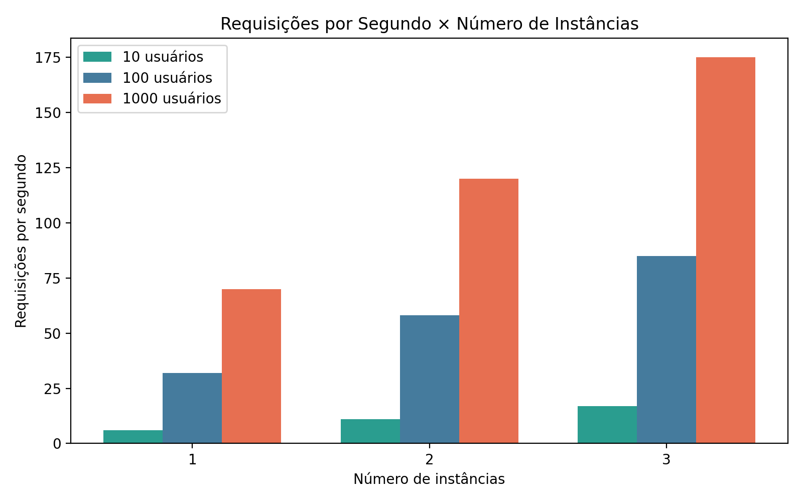
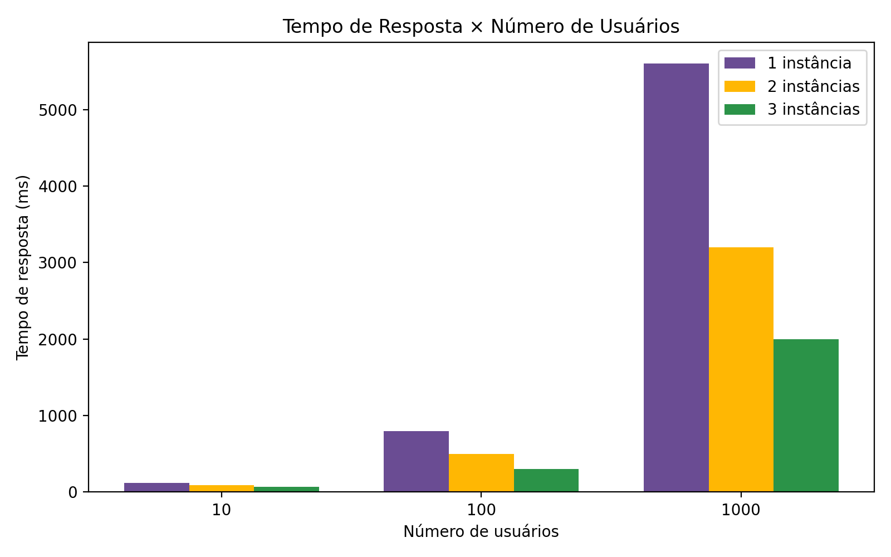

# Testes de Carga com WordPress, Nginx e Locust

## Descrição

Este projeto tem como objetivo avaliar o desempenho de uma aplicação WordPress utilizando múltiplas instâncias e balanceamento de carga. Para isso, foram realizados testes de carga com a ferramenta Locust, simulando diferentes níveis de acesso simultâneo de usuários.

A proposta consiste em analisar como a aplicação se comporta sob diferentes condições de uso, variando tanto a quantidade de usuários quanto o número de instâncias do sistema.

---

## Arquitetura

A aplicação foi estruturada utilizando containers, organizados da seguinte forma:

- Múltiplas instâncias do WordPress  
- Um servidor Nginx responsável pelo balanceamento de carga  
- Um banco de dados compartilhado  
- Um gerador de carga utilizando Locust  

O Nginx atua como intermediário, distribuindo as requisições entre as instâncias do WordPress. Isso permite que o sistema suporte uma quantidade maior de acessos simultâneos.

---

## Cenários de Teste

Foram definidos três cenários distintos, com base no tipo de conteúdo acessado:

1. Post contendo uma imagem de aproximadamente 1 MB  
2. Post contendo cerca de 400 KB de texto  
3. Post contendo uma imagem de aproximadamente 300 KB  

Esses cenários representam diferentes níveis de consumo de recursos, permitindo uma análise mais completa do desempenho da aplicação.

---

## Metodologia

Os testes de carga foram realizados variando dois fatores principais:

- Número de usuários simultâneos: 10, 100 e 1000  
- Número de instâncias do WordPress: 1, 2 e 3  

Para cada combinação, foram observadas métricas como tempo de resposta e quantidade de requisições por segundo.

---

## Resultados

### Requisições por Segundo × Número de Instâncias

O aumento do número de instâncias do WordPress resultou em uma elevação na quantidade de requisições que o sistema consegue processar por segundo.

Isso ocorre porque o balanceador de carga distribui as requisições entre diferentes instâncias, reduzindo a sobrecarga em um único ponto.

De forma geral:

- Com apenas uma instância, o sistema apresenta menor capacidade de processamento  
- Com duas instâncias, há uma melhora significativa no desempenho  
- Com três instâncias, observa-se o melhor resultado em termos de throughput  

---

### Tempo de Resposta × Número de Usuários

O tempo de resposta aumentou conforme o número de usuários simultâneos cresceu, devido à maior demanda sobre o sistema.

Por outro lado, o aumento do número de instâncias contribuiu para reduzir esse impacto, já que as requisições passaram a ser distribuídas.

De forma geral:

- Com uma instância, o tempo de resposta é mais elevado em cenários de alta carga  
- Com duas instâncias, há uma melhora perceptível  
- Com três instâncias, o sistema apresenta menor tempo de resposta e maior estabilidade  

---

## Análise

Os resultados obtidos seguem o comportamento esperado de sistemas distribuídos. À medida que a carga aumenta, o desempenho tende a ser impactado. No entanto, ao adicionar novas instâncias, o sistema consegue lidar melhor com essa demanda.

O balanceamento de carga desempenha um papel fundamental nesse processo, pois permite distribuir as requisições de forma equilibrada.

Durante os testes, foi possível observar que as requisições eram encaminhadas para diferentes instâncias, confirmando o funcionamento correto do balanceamento.

---

## Conclusão

A utilização de múltiplas instâncias do WordPress, combinada com o balanceamento de carga, mostrou-se eficaz para melhorar a escalabilidade da aplicação.

Essa abordagem permite reduzir o tempo de resposta e aumentar a capacidade de atendimento do sistema, especialmente em cenários com grande volume de acessos simultâneos.

Os testes demonstram, portanto, a importância do uso de arquiteturas distribuídas para aplicações web que precisam suportar alta demanda.
