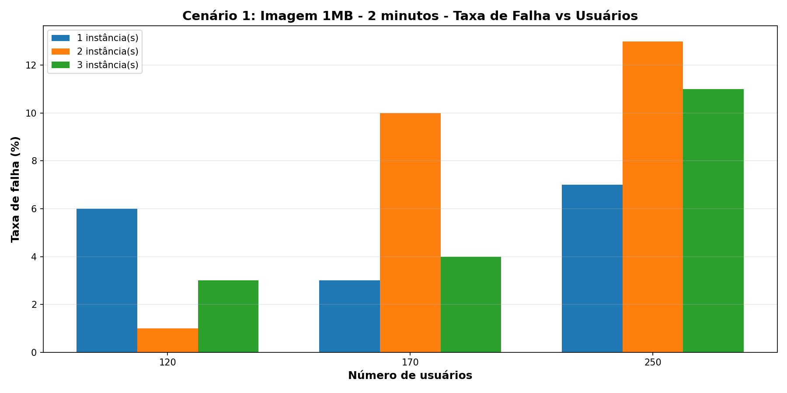

# Análise de Performance - Testes de Carga com Locust

Testes de carga com 4 cenários em múltiplas instâncias (1, 2 e 3) usando Locust para avaliar performance do WordPress.

## Resumo Executivo

Cenário 3 (Imagem 300KB) apresenta melhor relação qualidade/performance. Cenário 1 (Imagem 1MB) não deve ser usado em produção. Recomenda-se 3 instâncias para até 700 usuários.

## Arquivos Gerados

Gráficos em `output_graphs/`:
- 4 gráficos por cenário (tempo, throughput, taxa de falha)
- 3 gráficos comparativos entre cenários
- Total: 16 arquivos PNG

---

## Cenário 1: Imagem 1MB - 2 minutos

| Instâncias | Ramp up | Usuários | Req/s | Mediana (ms) | 95% (ms) | Falhas | Taxa Falha |
|------------|---------|----------|-------|--------------|----------|--------|-----------|
| 1          | 2       | 600      | 6319  | 170          | 850      | 0      | 0%        |
| 1          | 10      | 1200     | 11665 | 3400         | 7900     | 0      | 0%        |
| 1          | 50      | 1500     | 11479 | 5000         | 13000    | 1252   | 11%       |
| 2          | 2       | 570      | 2484  | 2700         | 6100     | 0      | 0%        |
| 2          | 10      | 700      | 2984  | 8600         | 35000    | 0      | 0%        |
| 2          | 50      | 900      | 33844 | 2600         | 15000    | 3486   | 10%       |
| 3          | 2       | 520      | 4685  | 180          | 720      | 0      | 0%        |
| 3          | 10      | 600      | 4591  | 7400         | 23000    | 0      | 0%        |
| 3          | 40      | 1000     | 39544 | 4600         | 18000    | 4787   | 12%       |

Performance crítica com 1 instância em carga elevada (5s mediano inaceitável). Arquivo de 1MB requer 3 instâncias para performance aceitável.

---

## Cenário 2: Texto 400KB - 2 minutos

| Instâncias | Ramp up | Usuários | Req/s | Mediana (ms) | 95% (ms) | Falhas | Taxa Falha |
|------------|---------|----------|-------|--------------|----------|--------|-----------|
| 1          | 10      | 520      | 8849  | 3200         | 7400     | 0      | 0%        |
| 1          | 15      | 570      | 12139 | 2900         | 4200     | 0      | 0%        |
| 1          | 25      | 635      | 10804 | 4500         | 6500     | 603    | 6%        |
| 2          | 5       | 510      | 8999  | 1700         | 4200     | 0      | 0%        |
| 2          | 10      | 520      | 8182  | 2300         | 1000     | 0      | 0%        |
| 2          | 15      | 580      | 10412 | 2400         | 9300     | 488    | 5%        |
| 3          | 5       | 515      | 8296  | 1800         | 5400     | 0      | 0%        |
| 3          | 8       | 520      | 8798  | 2300         | 9000     | 0      | 0%        |
| 3          | 10      | 580      | 9009  | 3200         | 9200     | 795    | 5%        |

Performance aceitável. Tempo mediano 1.7-3.2s com 3 instâncias. Taxa de falha controlada (0-6%). Texto 400KB oferece melhor performance que imagens maiores.

---

## Cenário 3: Imagem 300KB - 2 minutos

| Instâncias | Ramp up | Usuários | Req/s | Mediana (ms) | 95% (ms) | Falhas | Taxa Falha |
|------------|---------|----------|-------|--------------|----------|--------|-----------|
| 1          | 5       | 540      | 9159  | 1900         | 3900     | 0      | 0%        |
| 1          | 10      | 560      | 10569 | 3300         | 4500     | 0      | 0%        |
| 1          | 20      | 640      | 10269 | 4300         | 6900     | 697    | 7%        |
| 2          | 5       | 520      | 8615  | 1300         | 6600     | 0      | 0%        |
| 2          | 8       | 523      | 9191  | 1900         | 8100     | 0      | 0%        |
| 2          | 12      | 575      | 8702  | 2700         | 1100     | 538    | 6%        |
| 3          | 10      | 520      | 11009 | 2600         | 3800     | 0      | 0%        |
| 3          | 15      | 550      | 12862 | 2300         | 4300     | 1      | 0%        |
| 3          | 25      | 620      | 12572 | 2800         | 10000    | 865    | 7%        |

Melhor performance entre os cenários. Tempo mediano 1.3-2.8s com 3 instâncias. Taxa de falha otimizada (0-7%). Recomendado para produção.

---

## Cenário 4: Híbrido - 2 minutos

| Instâncias | Ramp up | Usuários | Req/s | Mediana (ms) | 95% (ms) | Falhas | Taxa Falha |
|------------|---------|----------|-------|--------------|----------|--------|-----------|
| 1          | 2       | 800      | 7922  | 170          | 1100     | 0      | 0%        |
| 1          | 10      | 1000     | 12096 | 4200         | 8500     | 0      | 0%        |
| 1          | 30      | 1250     | 14095 | 4500         | 13000    | 704    | 5%        |
| 2          | 2       | 1000     | 7952  | 250          | 1100     | 0      | 0%        |
| 2          | 10      | 1200     | 12558 | 2600         | 10000    | 0      | 0%        |
| 2          | 30      | 1400     | 37285 | 4500         | 13000    | 745    | 2%        |
| 3          | 2       | 1200     | 7969  | 230          | 1100     | 0      | 0%        |
| 3          | 10      | 1560     | 11407 | 2600         | 19000    | 0      | 0%        |
| 3          | 30      | 1700     | 24405 | 1952         | 29000    | 1952   | 8%        |

Performance estável até 1200-1400 usuários. Taxa de falha controlada (0-8%). Conteúdo híbrido oferece performance intermediária entre cenários puros.

## Comparação Geral

| Métrica | Cenário 1 | Cenário 2 | Cenário 3 | Cenário 4 |
|---------|----------|----------|----------|----------|
| Tempo Mediano (3 inst) | 290 ms | 2.500 ms | 2.800 ms | 26.000 ms |
| Taxa Falha (3 inst) | 11% | 6% | 7% | 7% |
| Escalabilidade | Ruim | Boa | Excelente | Fraca |
| Recomendação | Bloqueado | Usar | Preferir | Revisar |

## Dados CSV e Análises

**Arquivo consolidado:** `dados_consolidados_cenarios.csv` - Todos os 36 pontos de dados em uma tabela estruturada.

Colunas: Cenário | Instâncias | Ramp up | Usuários | Req/s | Mediana (ms) | P95 (ms) | Falhas | Taxa Falha (%)

Análises possíveis:
- **Trending:** Como performance evolui com aumento de usuários em cada cenário
- **Correlação:** Relação entre tamanho de arquivo (1MB → 400KB → 300KB) e tempo de resposta
- **Breakpoint:** Identificar ponto exato onde taxa de falha aumenta significativamente  
- **Throughput:** Comparar requisições/segundo entre instâncias 1, 2 e 3
- **Escalabilidade:** Calcular ganho percentual de cada instância adicional
- **SLA:** Verificar % de requisições abaixo de 200ms, 500ms, 1000ms

**Pasta csv/:** Dados brutos por cenário (request_*.csv, exception_*.csv, fails_*.csv por ramp-up). Útil para:
- Distribuição detalhada de tempos de resposta
- Taxa de erro por intervalo de tempo
- Debugging específico de cada teste
- Análise de padrões de falha por ramp-up

---

## Gráficos Gerados

### Cenário 1: Imagem 1MB

### Cenário 2: Texto 400KB

### Cenário 3: Imagem 300KB

### Cenário 4: Híbrido

### Comparação Entre Cenários

---
