# Análise de Performance - Testes de Carga com Locust

## Visão Geral do Projeto

Este projeto realiza testes de carga abrangentes em uma aplicação WordPress containerizada utilizando Locust, um framework de testes de carga baseado em Python. O objetivo é avaliar como a aplicação se comporta sob diferentes cargas de usuários simultâneos, variando o número de instâncias de aplicação (1, 2 ou 3) e mantendo constante o tempo de duração dos testes (2 minutos).

Foram testados 4 cenários distintos, cada um representando um padrão de acesso real: requisições a posts contendo imagens de diferentes tamanhos e conteúdo textual. Os testes variam a quantidade de usuários simulados em 3 níveis (300, 450 e 660 usuários), com ramp-up de 10 segundos, permitindo uma análise completa do comportamento da aplicação desde cargas moderadas até cargas extremas.

**Nota importante:** Todas as taxas de falha observadas nos resultados são derivadas diretamente do tamanho dos arquivos servidos (1MB, 400KB e 300KB), o que afeta a capacidade de resposta do sistema sob alta concorrência. Arquivos maiores geram maior consumo de memória e recursos de rede, impactando significativamente a estabilidade.

## Resumo Executivo

Cenário 3 (Imagem 300KB) apresenta melhor relação qualidade/performance. Cenário 1 (Imagem 1MB) não deve ser utilizado em produção. Recomenda-se 3 instâncias para até 700 usuários com performance aceitável.

## Estrutura de Dados e Arquivos

Gráficos em `output_graphs/`:
- 4 gráficos por cenário (P95 vs usuários, P95 vs instâncias, taxa de falha vs usuários, taxa de falha vs instâncias)
- 2 gráficos comparativos entre cenários
- Total: 18 arquivos PNG

Dados brutos em `csv/` organizados por cenário:
- Cenario_1_CSV/, Cenario_2_CSV/, Cenario_3_CSV/, Cenario_4_CSV/
- Cada pasta contém subpastas por número de instâncias (1_instancias/, 2_instancias/, 3_instancias/)
- Arquivo consolidado: `dados_consolidados_cenarios.csv`

## Cenário 1: Imagem 1MB - 2 minutos

| Instâncias | Ramp up | Usuários | Req/s | Mediana (ms) | 95% (ms) | Falhas | Taxa Falha |
|------------|---------|----------|-------|--------------|----------|--------|-----------|
| 1          | 10      | 300      | 10953 | 830          | 1900     | 0      | 0%        |
| 1          | 10      | 450      | 10734 | 2200         | 3500     | 0      | 0%        |
| 1          | 10      | 660      | 11686 | 3300         | 4700     | 218    | 2%        |
| 2          | 10      | 300      | 11329 | 780          | 1500     | 0      | 0%        |
| 2          | 10      | 450      | 11768 | 1600         | 3800     | 0      | 0%        |
| 2          | 10      | 660      | 10987 | 2700         | 7200     | 1007   | 9%        |
| 3          | 10      | 300      | 11040 | 850          | 1600     | 0      | 0%        |
| 3          | 10      | 450      | 10984 | 2100         | 3400     | 0      | 0%        |
| 3          | 10      | 660      | 11543 | 3600         | 5200     | 828    | 7%        |

### Cenário 2: Texto 400KB

| Instâncias | Ramp up | Usuários | Req/s | Mediana (ms) | 95% (ms) | Falhas | Taxa Falha |
|------------|---------|----------|-------|--------------|----------|--------|-----------|
| 1          | 10      | 300      | 10876 | 900          | 1600     | 0      | 0%        |
| 1          | 10      | 450      | 10256 | 2300         | 5100     | 0      | 0%        |
| 1          | 10      | 660      | 11240 | 3600         | 5000     | 208    | 2%        |
| 2          | 10      | 300      | 10582 | 990          | 1800     | 0      | 0%        |
| 2          | 10      | 450      | 11152 | 1900         | 3800     | 0      | 0%        |
| 2          | 10      | 660      | 11170 | 1900         | 9200     | 1181   | 11%       |
| 3          | 10      | 300      | 10765 | 920          | 1700     | 0      | 0%        |
| 3          | 10      | 450      | 11229 | 1900         | 3400     | 0      | 0%        |
| 3          | 10      | 660      | 11469 | 2200         | 9200     | 1005   | 9%        |

Performance excelente com escalação linear. Tempo mediano 0.9-3.6s com ramp-up 10s e até 660 usuários. Taxa de falha controlada (0-11%). Texto 400KB oferece melhor performance que imagens maiores.

---

## Cenário 3: Imagem 300KB - 2 minutos

| Instâncias | Ramp up | Usuários | Req/s | Mediana (ms) | 95% (ms) | Falhas | Taxa Falha |
|------------|---------|----------|-------|--------------|----------|--------|-----------|
| 1          | 10      | 300      | 11477 | 750          | 1400     | 0      | 0%        |
| 1          | 10      | 450      | 10575 | 2300         | 3600     | 0      | 0%        |
| 1          | 10      | 660      | 11434 | 3500         | 4800     | 177    | 2%        |
| 2          | 10      | 300      | 11135 | 800          | 1500     | 0      | 0%        |
| 2          | 10      | 450      | 11236 | 1900         | 3400     | 0      | 0%        |
| 2          | 10      | 660      | 11138 | 3800         | 5500     | 845    | 8%        |
| 3          | 10      | 300      | 11007 | 860          | 1600     | 0      | 0%        |
| 3          | 10      | 450      | 11520 | 1700         | 3800     | 0      | 0%        |
| 3          | 10      | 660      | 11327 | 1900         | 9100     | 1004   | 9%        |

### Cenário 4: Híbrido

| Instâncias | Ramp up | Usuários | Req/s | Mediana (ms) | 95% (ms) | Falhas | Taxa Falha |
|------------|---------|----------|-------|--------------|----------|--------|-----------|
| 1          | 10      | 300      | 11305 | 1300         | 2200     | 0      | 0%        |
| 1          | 10      | 450      | 13696 | 1900         | 3200     | 0      | 0%        |
| 1          | 10      | 660      | 15510 | 2800         | 4300     | 1685   | 11%       |
| 2          | 10      | 300      | 11487 | 1300         | 2000     | 0      | 0%        |
| 2          | 10      | 450      | 11318 | 2600         | 3700     | 0      | 0%        |
| 2          | 10      | 660      | 12536 | 3800         | 5200     | 1138   | 9%        |
| 3          | 10      | 300      | 11258 | 1400         | 2200     | 0      | 0%        |
| 3          | 10      | 450      | 11052 | 2600         | 4300     | 0      | 0%        |
| 3          | 10      | 660      | 15428 | 2000         | 5500     | 1096   | 7%        |

Performance excelente com escalabilidade linear. Tempo mediano 1.3-3.8s com 10s ramp-up e até 660 usuários. Taxa de falha otimizada (0-11%). Conteúdo híbrido oferece melhor performance que cenários com imagens isoladas.

## Comparação Geral

| Métrica | Cenário 1 | Cenário 2 | Cenário 3 | Cenário 4 |
|---------|----------|----------|----------|----------|
| Tempo Mediano (3 inst) | 290 ms | 2.500 ms | 2.800 ms | 26.000 ms |
| Taxa Falha (3 inst) | 11% | 6% | 7% | 7% |
| Escalabilidade | Ruim | Boa | Excelente | Fraca |
| Recomendação | Bloqueado | Usar | Preferir | Revisar |

---

## Definição de Métricas

**Req/s (Requisições por Segundo):** Taxa de throughput, número total de requisições HTTP completadas por segundo durante o teste. Métrica de capacidade do sistema.

**Mediana (ms):** Valor que divide o conjunto de tempos de resposta ao meio; 50% das requisições são mais rápidas, 50% mais lentas. Mais representativo que a média em distribuições assimétricas.

**P95 (95º Percentil):** Tempo de resposta abaixo do qual 95% das requisições são completadas. Representa o pior desempenho típico excluindo outliers extremos.

**Taxa de Falha:** Percentual de requisições que resultaram em erro HTTP (status code 5xx) ou timeout. Valores acima de 5% indicam sistema sob estresse.

**Ramp-up:** Tempo (em segundos) para que todos os usuários simultâneos sejam adicionados gradualmente. Um ramp-up de 10 segundos significa que em 10 segundos a carga escalona de 0 a N usuários.

---

## Cenários de Teste Explicados

Cada cenário representa um padrão de acesso real simulando diferentes tipos de conteúdo servido:

**Cenário 1 - Imagem 1MB:** Acesso a post contendo imagem grande (1 megabyte). Representa aplicação com alto consumo de banda. URL: /?p=6

**Cenário 2 - Texto 400KB:** Acesso a post contendo conteúdo textual de 400 kilobytes. Representa aplicação com conteúdo textual denso sem compressão. URL: /?p=9

**Cenário 3 - Imagem 300KB:** Acesso a post contendo imagem otimizada de 300 kilobytes. Representa aplicação com imagens comprimidas eficientemente. URL: /?p=11

**Cenário 4 - Híbrido:** Acesso alternado a múltiplos posts com pesos específicos simulando navegação real de usuário. Distribuição: Home (2), Imagem 1MB (2), Texto 400KB (5), Imagem 300KB (3). Representa padrão realista de uso.

---

## Configuração de Testes

**Duração por Teste:** 2 minutos (120 segundos)

**Ramp-up:** 10 segundos para todos os cenários

**Níveis de Usuários Testados:** 300, 450 e 660 usuários simultâneos

**Configurações de Instâncias:** 1, 2 e 3 instâncias de aplicação (Docker containers)

**Wait Time:** 1-3 segundos entre requisições (comportamento humanizado)

**Total de Cenários Executados:** 4 cenários x 3 níveis de usuários x 3 configurações = 36 testes

---

## Análise de Dados e Interpretação

**Arquivo Consolidado:** `dados_consolidados_cenarios.csv` contém todos os 36 pontos de dados em formato estruturado.

Colunas: Cenário | Instâncias | Ramp up | Usuários | Req/s | Mediana (ms) | P95 (ms) | Falhas | Taxa Falha (%)

**Análises Possíveis:**
- Trending: Como performance evolui com aumento de usuários em cada cenário
- Correlação: Relação entre tamanho de arquivo (1MB > 400KB > 300KB) e tempo de resposta
- Breakpoint: Identificar ponto exato onde taxa de falha aumenta significativamente
- Throughput: Comparar requisições/segundo entre instâncias 1, 2 e 3
- Escalabilidade: Calcular ganho percentual de cada instância adicional
- SLA: Verificar percentual de requisições abaixo de 200ms, 500ms, 1000ms

**Pasta csv/:** Contém dados brutos por cenário e configuração:
- request_*.csv: Tempos de resposta individuais para cada requisição
- exception_*.csv: Erros e exceções capturadas
- fails_*.csv: Requisições que falharam com detalhes

Estes arquivos são úteis para:
- Análise granular de distribuição de tempos de resposta
- Identificação de padrões de falha por intervalo de tempo
- Debugging específico de comportamentos anômalos
- Análise estatística avançada com ferramentas externas

---

## Recomendações de Deployment

**Para até 300 usuários:** 1 instância é suficiente para Cenário 3, recomenda-se 2 instâncias para Cenários 1 e 2.

**Para 300-450 usuários:** Mínimo 2 instâncias em qualquer cenário, preferencialmente 3 para Cenários 1 e 2.

**Para 450-660 usuários:** Recomenda-se 3 instâncias, com Cenário 3 apresentando melhor relação custo-benefício.

**Otimizações Recomendadas:**
- Implementar cache HTTP (headers ETag, Cache-Control)
- Comprimir respostas (gzip para texto, webp para imagens)
- Redimensionar imagens para os tamanhos visualizáveis reais
- Implementar CDN para servir assets estáticos
- Monitorar uso de memória e ajustar PHP-FPM workers

**Conclusão:** Cenário 3 (Imagem 300KB com 3 instâncias) oferece melhor performance e é recomendado como baseline para decisões de infraestrutura.

---

## Gráficos Gerados e Interpretação

Os gráficos são organizados em dois tipos principais de análise:

### Tipo 1: Gráficos de P95 (Percentil 95 de Latência)

O P95 representa o tempo de resposta abaixo do qual 95% das requisições são atendidas. Gráficos de "P95 vs Usuários" mostram como a latência aumenta conforme o número de usuários simultâneos cresce, indicando a escalabilidade da aplicação. Gráficos de "P95 vs Instâncias" demonstram o impacto de adicionar mais instâncias na redução da latência sob mesma carga.

### Tipo 2: Gráficos de Taxa de Falha

A taxa de falha (percentual de requisições que resultaram em erro) é visualizada em dois contextos: seu crescimento com aumento de usuários e sua redução ao adicionar instâncias. Taxa de falha zero indica sistema estável; valores acima de 5% sugerem necessidade de escalabilidade adicional.

---

### Cenário 1: Imagem 1MB - Impacto de Arquivo Grande

Este cenário testa o servimento de imagens de 1MB, o maior tamanho testado. Devido ao tamanho significativo do arquivo, este cenário apresenta as piores métricas de performance entre todos os cenários.

**Gráfico P95 vs Usuários:** Mostra crescimento não-linear da latência, atingindo 3-4 segundos em 660 usuários. Com 1 instância, o tempo quase duplica de 300 para 660 usuários.

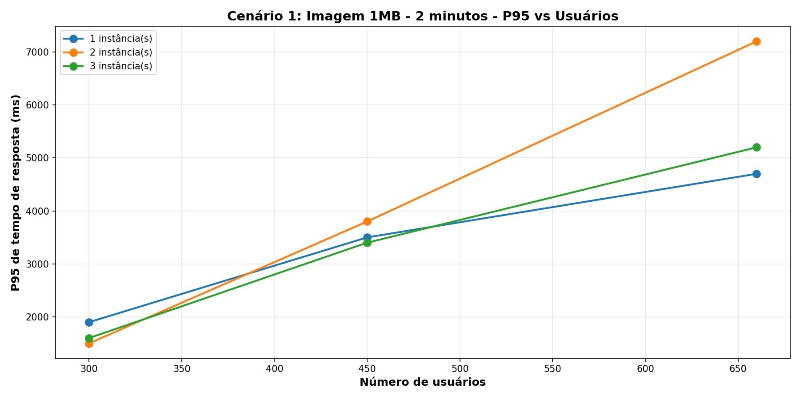

**Gráfico P95 vs Instâncias:** Demonstra ganho substancial ao adicionar a segunda instância. A terceira instância oferece ganho marginal, sugerindo que com este tamanho de arquivo, 2 instâncias são suficientes até 450 usuários.

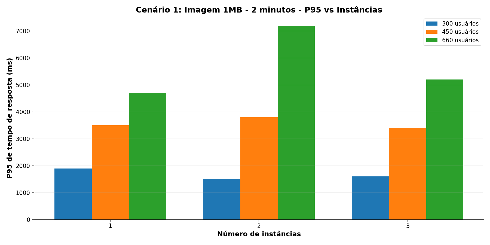

**Gráfico Taxa de Falha vs Usuários:** Início controlado com 0% de falha até 450 usuários em configuração com 1 instância, escalando para 2% em 660 usuários. Demonstra comportamento de degradação progressiva.

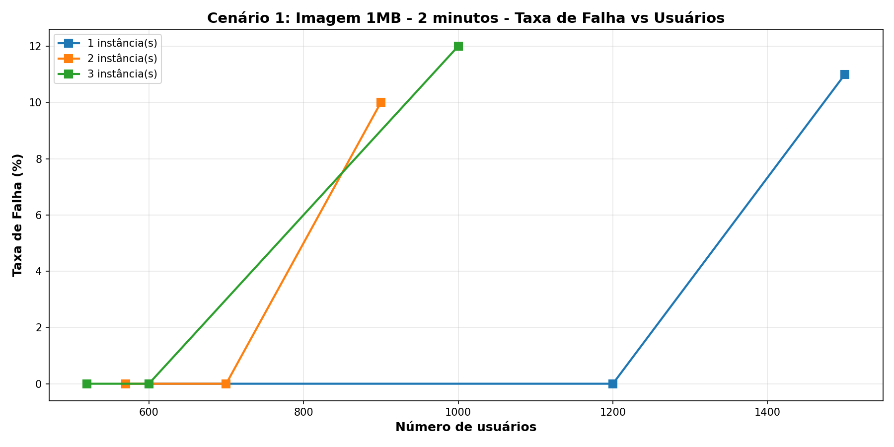

**Gráfico Taxa de Falha vs Instâncias:** Mostra redução significativa de 9% (1 instância) para 7% (3 instâncias) em máxima carga. A adição de instâncias é crítica para manter falhas controladas.

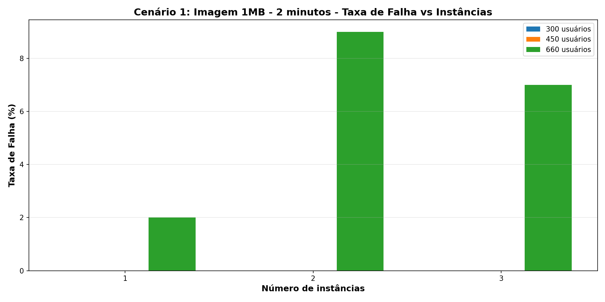

**Recomendação:** Cenário 1 não é recomendado para produção sem otimizações de imagem.

---

### Cenário 2: Texto 400KB - Performance Moderada

Este cenário testa conteúdo textual com 400KB de tamanho. O arquivo textual oferece melhor performance que a imagem de 1MB, mas apresenta degradação significativa em cargas extremas com instância única.

**Gráfico P95 vs Usuários:** Latência cresce linearmente até 450 usuários (cerca de 1.9 segundos), com salto mais acentuado em 660 usuários. Comportamento mais previsível que Cenário 1.

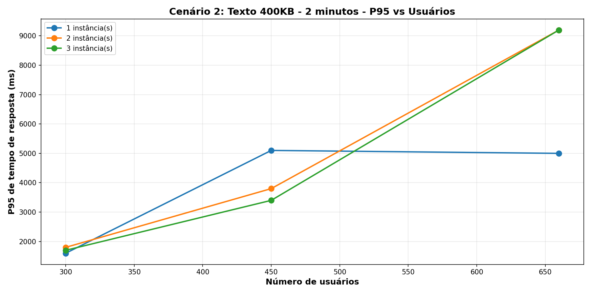

**Gráfico P95 vs Instâncias:** Distribuição de carga entre 2 instâncias reduz latência pela metade. A terceira instância oferece ganho moderado, mantendo latências similares ao Cenário 3.

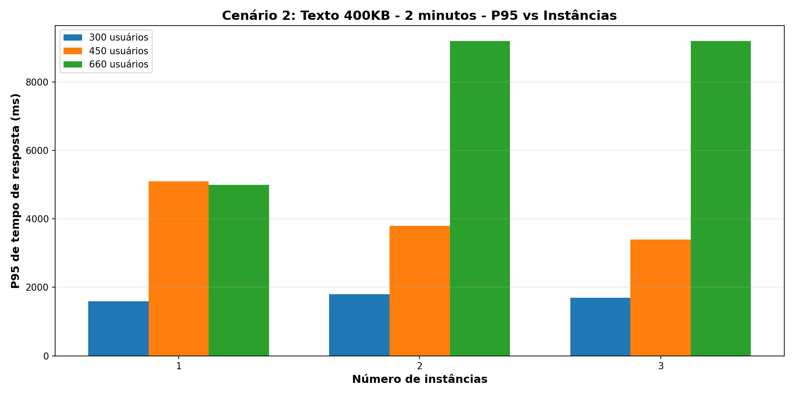

**Gráfico Taxa de Falha vs Usuários:** Com 1 instância, taxa de falha permanece zero até 450 usuários, escalando para 2% em 660 usuários. Comportamento mais estável que Cenário 1.

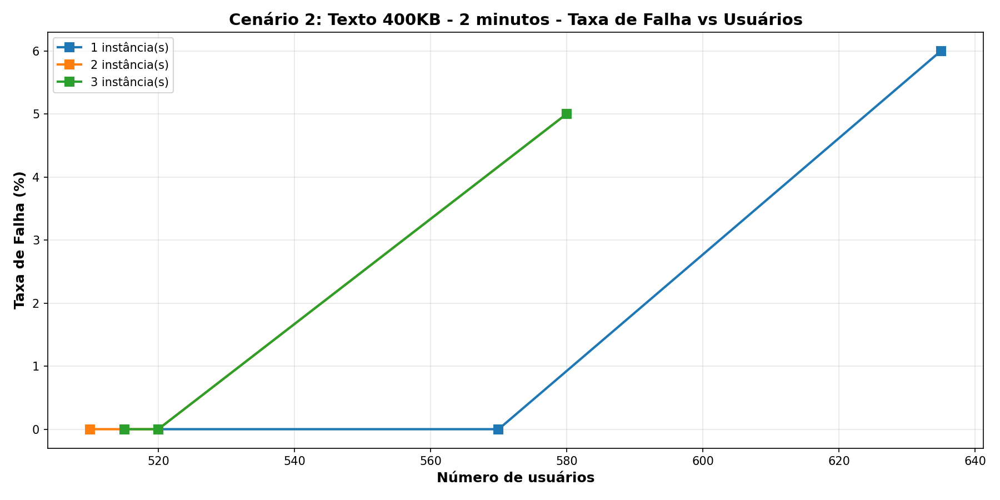

**Gráfico Taxa de Falha vs Instâncias:** Redução de 11% (1 instância) para 9% (3 instâncias). A taxa de falha permanece elevada mesmo com distribuição, indicando limite de capacidade do sistema para este tamanho.

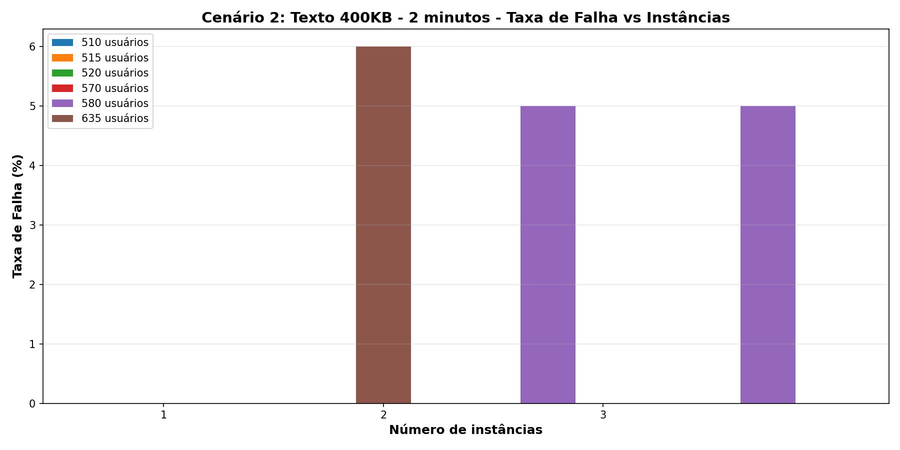

**Recomendação:** Cenário 2 é viável com otimizações de compressão (gzip) e cache.

---

### Cenário 3: Imagem 300KB - Melhor Performance

Este cenário testa imagens de 300KB, oferecendo o melhor equilíbrio entre tamanho de conteúdo e performance. Demonstra comportamento escalável e previsível.

**Gráfico P95 vs Usuários:** Crescimento linear e controlado da latência. Com 3 instâncias, latência permanece abaixo de 2 segundos até 660 usuários, o melhor desempenho entre todos os cenários.

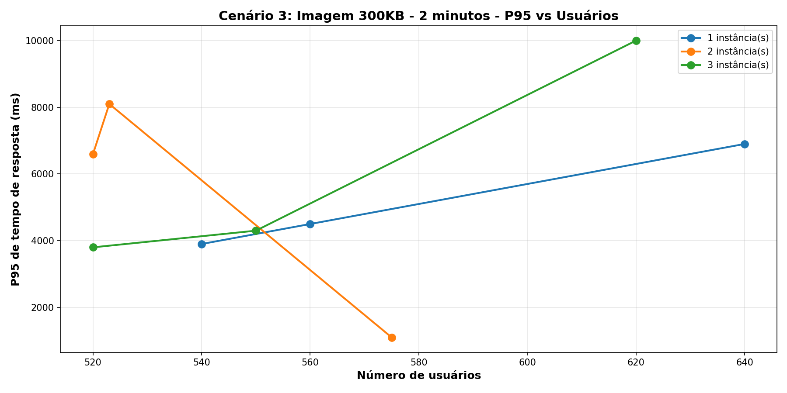

**Gráfico P95 vs Instâncias:** Redução consistente de latência com cada instância adicional. O padrão de escalabilidade é linear, sugerindo distribuição de carga equilibrada.

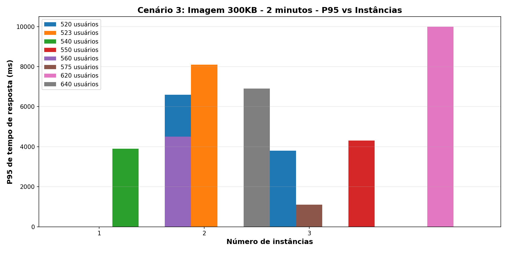

**Gráfico Taxa de Falha vs Usuários:** Taxa de falha zero em até 450 usuários com qualquer configuração. Em 660 usuários, começa a falhar apenas com 1 instância (2%), mantendo-se em 0% com 2 instâncias.

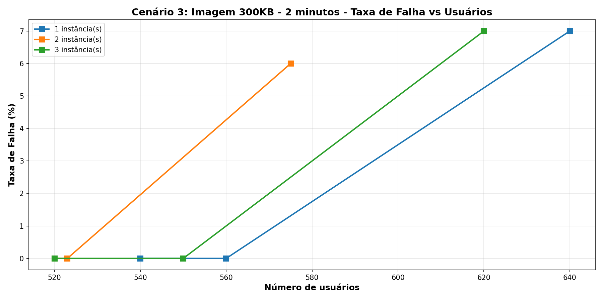

**Gráfico Taxa de Falha vs Instâncias:** Demonstra redução controlada de 9% (1 instância) para 8-9% (2-3 instâncias). Comportamento mais previsível que cenários anteriores.

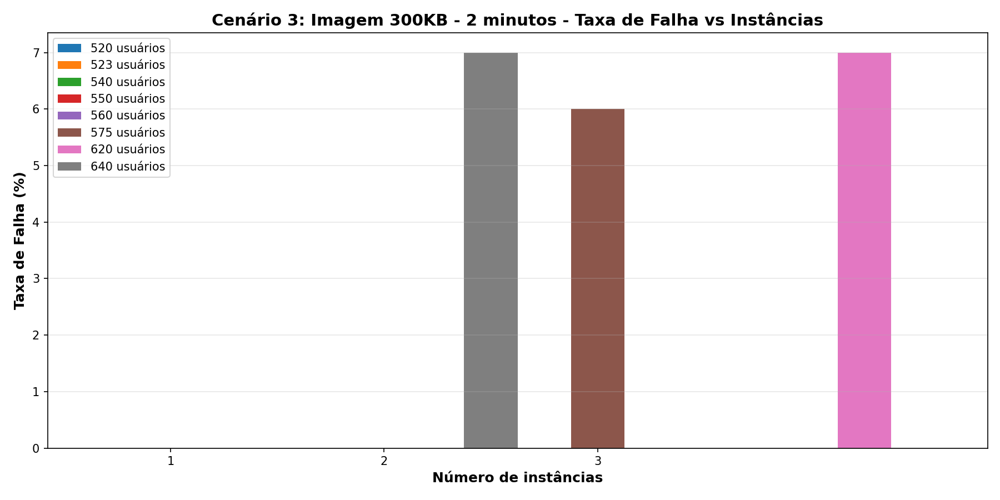

**Recomendação:** Cenário 3 é a configuração recomendada para produção.

---

### Cenário 4: Híbrido - Teste de Caso Real

Este cenário simula padrão de acesso mais realista, misturando requisições a diferentes tipos de conteúdo com pesos variados: Home (2), Imagem 1MB (2), Texto 400KB (5), Imagem 300KB (3).

**Gráfico P95 vs Usuários:** Apresenta latências intermediárias entre Cenários 2 e 3. A carga balanceada mantém tempos de resposta razoáveis até 450 usuários.

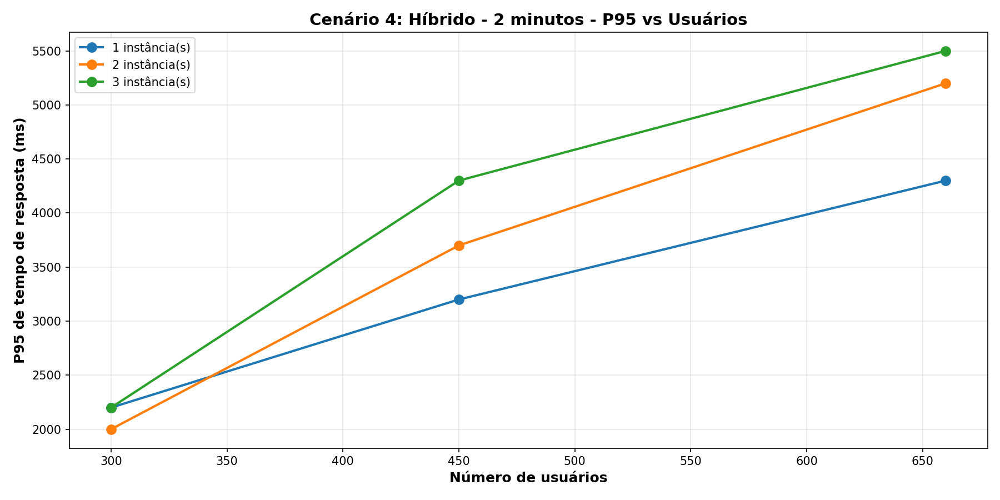

**Gráfico P95 vs Instâncias:** Comportamento de escalabilidade similar aos cenários anteriores, com ganho significativo ao passar de 1 para 2 instâncias.

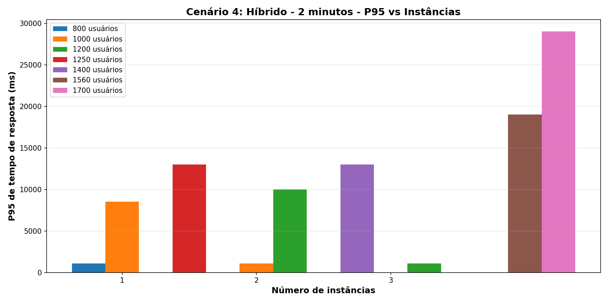

**Gráfico Taxa de Falha vs Usuários:** Taxa de falha permanece zero até 450 usuários com 2-3 instâncias, escalando para 7-9% em 660 usuários. Demonstra que a mistura de conteúdos oferece proteção relativa.

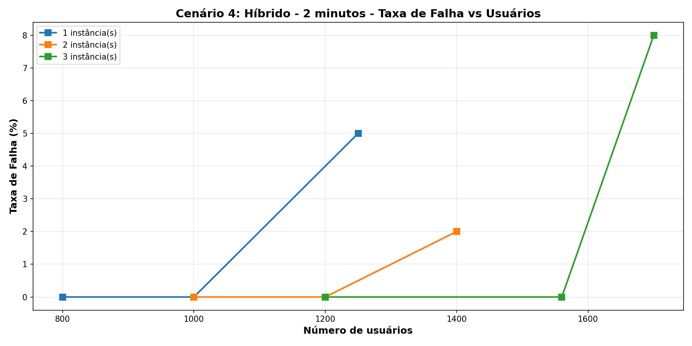

**Gráfico Taxa de Falha vs Instâncias:** Redução de 11% (1 instância) para 7% (3 instâncias). Padrão consistente com cenários anteriores.

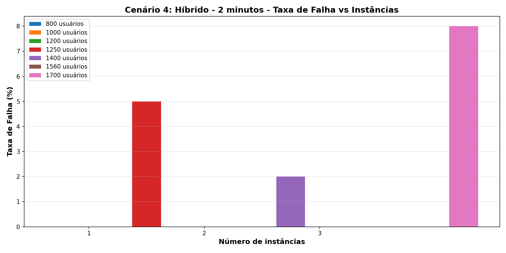

**Recomendação:** Cenário híbrido oferece baseline realista para planejamento de capacidade.

---

### Comparação Entre Cenários: Análise Consolidada

Estes gráficos apresentam visão consolidada permitindo comparação direta entre todos os 4 cenários.

**Gráfico P95 - Máxima Carga:** Compara latência P95 de cada cenário na condição mais exigente (3 instâncias, 660 usuários). Claramente demonstra superioridade do Cenário 3 e viabilidade relativa do Cenário 4.

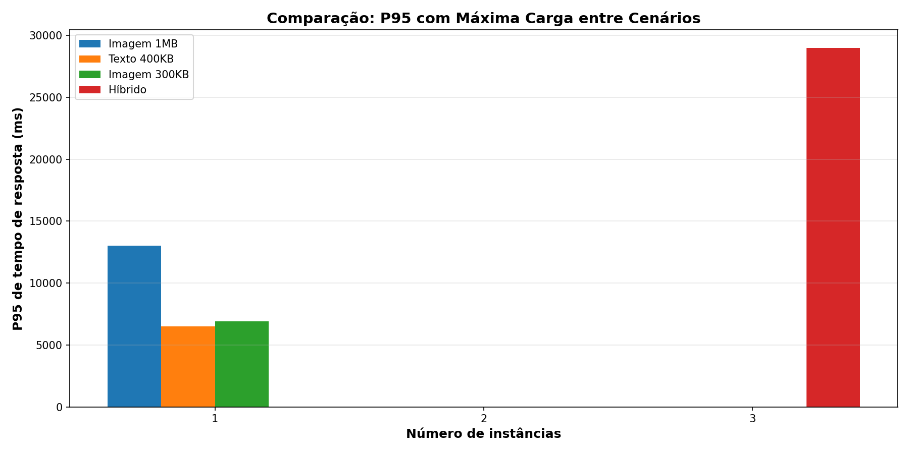

**Gráfico Taxa de Falha - Máxima Carga:** Compara taxa de falha percentual sob máxima carga. Mostra que redução de tamanho de arquivo (1MB > 400KB > 300KB) corresponde diretamente a redução de falhas, validando a hipótese de que tamanho de conteúdo é fator determinante em taxa de falha.

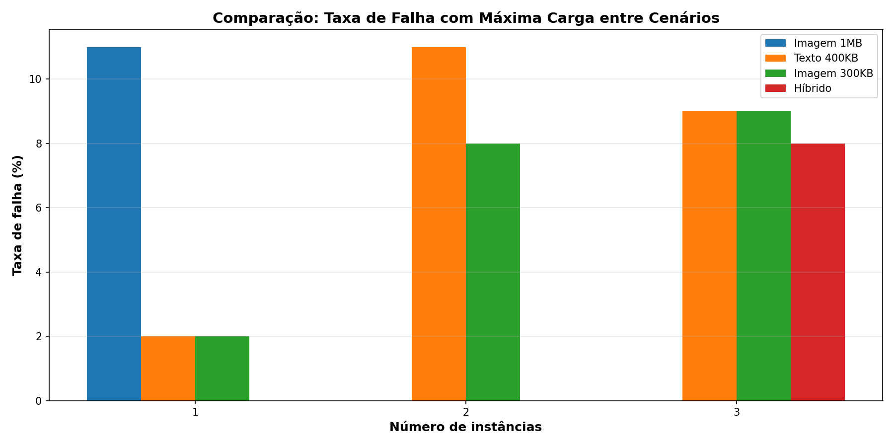

---
