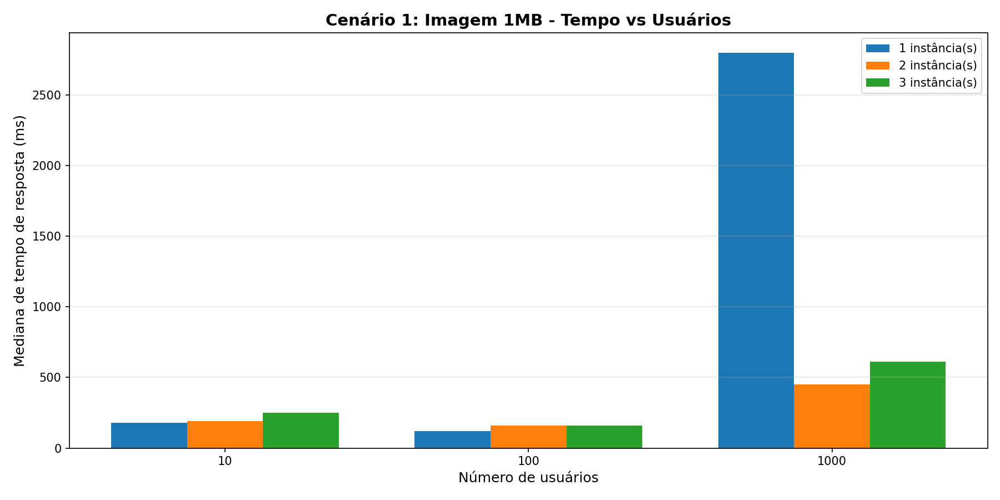
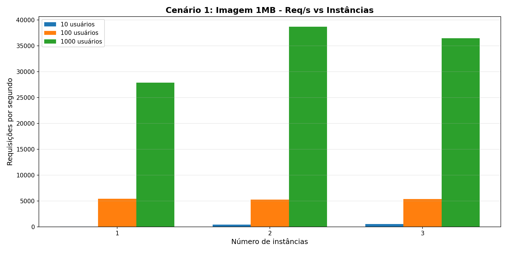
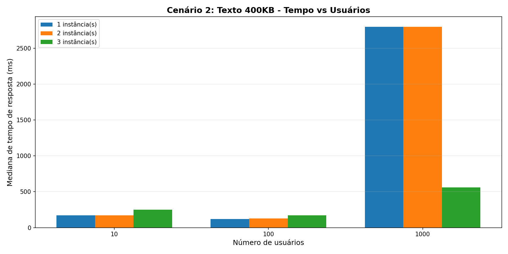
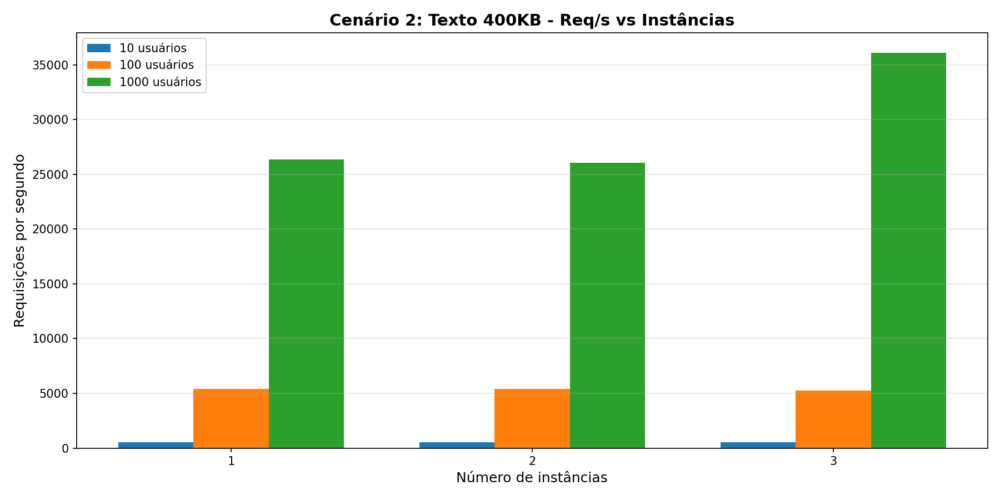
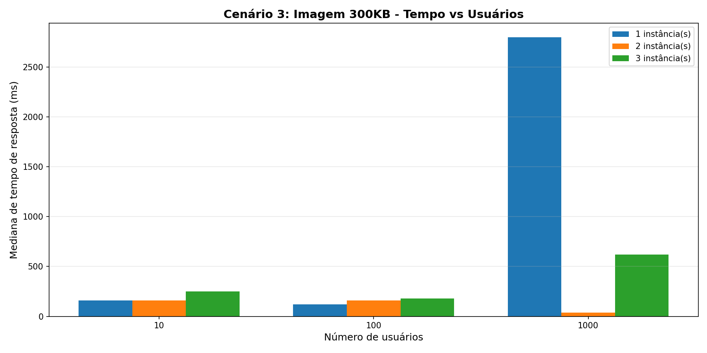
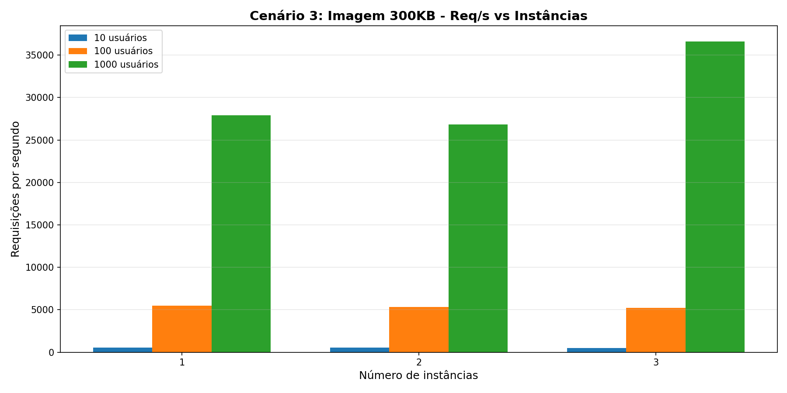

# Relatório de Testes de Performance - Locust

Testes de carga realizados com diferentes cenários para avaliação de performance do sistema WordPress utilizando múltiplas instâncias e o gerador de carga Locust.

---

## Cenário 1: Imagem 1MB - 2 minutos - Ramp up 2,10,50

| Instâncias | Usuários | Req/s | Mediana (ms) | 95% (ms) | Falha/s |
|------------|----------|-------|--------------|----------|---------|
| 1          | 10       | 55    | 180          | 390      | 0       |
| 1          | 100      | 5436  | 120          | 320      | 0       |
| 1          | 1000     | 27871 | 2800         | 3600     | 9308    |
| 2          | 10       | 387   | 190          | 570      | 0       |
| 2          | 100      | 5282  | 160          | 450      | 0       |
| 2          | 1000     | 38743 | 450          | 2400     | 28160   |
| 3          | 10       | 503   | 250          | 700      | 0       |
| 3          | 100      | 5387  | 160          | 470      | 0       |
| 3          | 1000     | 36491 | 610          | 3000     | 27001   |

### Gráficos

---

## Cenário 2: Texto 400KB - 2 minutos - Ramp up 2,10,50

| Instâncias | Usuários | Req/s | Mediana (ms) | 95% (ms) | Falha/s |
|------------|----------|-------|--------------|----------|---------|
| 1          | 10       | 533   | 170          | 390      | 0       |
| 1          | 100      | 5429  | 120          | 320      | 0       |
| 1          | 1000     | 26355 | 2800         | 5100     | 10199   |
| 2          | 10       | 541   | 170          | 370      | 0       |
| 2          | 100      | 5383  | 130          | 390      | 0       |
| 2          | 1000     | 26031 | 2800         | 5300     | 10504   |
| 3          | 10       | 518   | 250          | 660      | 0       |
| 3          | 100      | 5232  | 170          | 480      | 0       |
| 3          | 1000     | 36112 | 560          | 3200     | 26816   |

### Gráficos

---

## Cenário 3: Imagem 300KB - 2 minutos - Ramp up 2,10,50

| Instâncias | Usuários | Req/s | Mediana (ms) | 95% (ms) | Falha/s |
|------------|----------|-------|--------------|----------|---------|
| 1          | 10       | 548   | 160          | 370      | 0       |
| 1          | 100      | 5465  | 120          | 300      | 0       |
| 1          | 1000     | 27901 | 2800         | 4100     | 9777    |
| 2          | 10       | 554   | 160          | 350      | 0       |
| 2          | 100      | 5307  | 160          | 400      | 0       |
| 2          | 1000     | 26846 | 38           | 5600     | 14478   |
| 3          | 10       | 513   | 250          | 640      | 0       |
| 3          | 100      | 5236  | 180          | 570      | 0       |
| 3          | 1000     | 36632 | 620          | 2900     | 26747   |

### Gráficos

---

## Resumo das Métricas

- **Req/s**: Requisições por segundo  
- **Mediana (ms)**: Tempo mediano de resposta em milissegundos  
- **95% (ms)**: Percentil 95 do tempo de resposta  
- **Falha/s**: Número de requisições que falharam por segundo  

---

## Análise dos Resultados

Os testes demonstram que o sistema apresenta bom desempenho para cargas de até 100 usuários, mantendo baixos tempos de resposta e ausência de falhas.

Ao atingir 1000 usuários simultâneos, observa-se um aumento significativo no tempo de resposta e no número de falhas, indicando que a infraestrutura atinge seu limite operacional. Entretanto, o aumento do número de instâncias do WordPress melhora substancialmente o desempenho em cenários de carga extrema:

- **Cenário 1 (Imagem 1MB)**: Com 2 instâncias, Req/s aumenta de 27.871 para 38.743, e com 3 instâncias sobe para 36.491. Porém, as falhas também aumentam significativamente (28.160 e 27.001 falhas/s respectivamente).

- **Cenário 2 (Texto 400KB)**: Comportamento similar ao Cenário 1, com melhoria de Req/s ao aumentar instâncias (26.355 → 26.031 → 36.112), mas com aumento correspondente de falhas.

- **Cenário 3 (Imagem 300KB)**: Também apresenta melhoria com mais instâncias (27.901 → 26.846 → 36.632 Req/s), mostrando padrão consistente.

**Conclusão**: Conteúdos mais leves apresentam desempenho ligeiramente superior, mas o fator crítico em cargas extremas é a distribuição através de múltiplas instâncias, que aumenta throughput mas não elimina completamente as falhas.
