# Análise de Performance - Testes de Carga com Locust

Testes de carga com 4 cenários em múltiplas instâncias (1, 2 e 3) usando Locust para avaliar performance do WordPress.

## Resumo Executivo

Cenário 3 (Imagem 300KB) apresenta melhor relação qualidade/performance. Cenário 1 (Imagem 1MB) não deve ser usado em produção. Recomenda-se 3 instâncias para até 700 usuários.

## Arquivos Gerados

Gráficos em `output_graphs/`:
- 4 gráficos por cenário (tempo, throughput, taxa de falha)
- 3 gráficos comparativos entre cenários
- Total: 16 arquivos PNG

---

## Cenário 1: Imagem 1MB - 2 minutos

| Instâncias | Ramp up | Usuários | Req/s | Mediana (ms) | 95% (ms) | Taxa Falha |
|------------|---------|----------|-------|--------------|----------|-----------|
| 1          | 2       | 120      | 485   | 46000        | 68000    | 6%        |
| 1          | 10      | 170      | 319   | 45000        | 61000    | 3%        |
| 1          | 50      | 250      | 256   | 59000        | 86000    | 7%        |
| 2          | 2       | 120      | 12266 | 610          | 1200     | 1%        |
| 2          | 10      | 170      | 6289  | 1100         | 2000     | 10%       |
| 2          | 50      | 250      | 12372 | 3200         | 9100     | 13%       |
| 3          | 2       | 120      | 4107  | 510          | 1600     | 3%        |
| 3          | 10      | 170      | 7170  | 230          | 920      | 4%        |
| 3          | 50      | 250      | 12277 | 290          | 3500     | 11%       |

Performance crítica com 1 instância (59s mediano inaceitável). Arquivo de 1MB não recomendado para produção.

---

## Cenário 2: Texto 400KB - 2 minutos

| Instâncias | Ramp up | Usuários | Req/s | Mediana (ms) | 95% (ms) | Taxa Falha |
|------------|---------|----------|-------|--------------|----------|-----------|
| 1          | 15      | 570      | 12139 | 2900         | 4200     | 0%        |
| 1          | 20      | 600      | 10045 | 4500         | 6500     | 2%        |
| 1          | 25      | 635      | 10804 | 4500         | 6500     | 6%        |
| 2          | 5       | 560      | 8846  | 1500         | 4600     | 0%        |
| 2          | 10      | 570      | 9486  | 2100         | 8900     | 2%        |
| 2          | 15      | 580      | 10412 | 2400         | 9300     | 5%        |
| 3          | 15      | 580      | 11392 | 3000         | 5600     | 1%        |
| 3          | 25      | 610      | 11966 | 2900         | 8100     | 5%        |
| 3          | 30      | 630      | 12480| 2500         | 8500     | 6%        |

Performance aceitável. Tempo mediano 2.4-3.0s com 3 instâncias. Taxa de falha controlada (0-6%). Anomalia detectada: Inst.3 com 630 usuários mostra 124.840 req/s (verificar coleta).

---

## Cenário 3: Imagem 300KB - 2 minutos

| Instâncias | Ramp up | Usuários | Req/s | Mediana (ms) | 95% (ms) | Taxa Falha |
|------------|---------|----------|-------|--------------|----------|-----------|
| 1          | 15      | 570      | 11957 | 2900         | 4800     | 0%        |
| 1          | 20      | 600      | 11463 | 3700         | 5900     | 3%        |
| 1          | 25      | 650      | 12563 | 4000         | 5300     | 10%       |
| 2          | 15      | 550      | 10906 | 2300         | 7200     | 0%        |
| 2          | 20      | 600      | 11715 | 2900         | 8000     | 4%        |
| 2          | 25      | 615      | 11189 | 2500         | 9200     | 10%       |
| 3          | 15      | 550      | 12862 | 2300         | 4300     | 0%        |
| 3          | 20      | 600      | 11832 | 2600         | 8300     | 3%        |
| 3          | 25      | 620      | 12572 | 2800         | 10000    | 7%        |

Melhor performance entre os cenários. Tempo mediano 2.3-2.8s com 3 instâncias. Taxa de falha otimizada (0-7%). Recomendado para produção.

---

## Cenário 4: Híbrido - 2 minutos

| Instâncias | Ramp up | Usuários | Req/s | Mediana (ms) | 95% (ms) | Taxa Falha |
|------------|---------|----------|-------|--------------|----------|-----------|
| 1          | 2       | 500      | 4746  | 1300         | 4200     | 1%        |
| 1          | 10      | 600      | 3887  | 11000        | 21000    | 2%        |
| 1          | 30      | 700      | 4095  | 19000        | 25000    | 10%       |
| 2          | 2       | 500      | 7423  | 22000        | 1900     | 3%        |
| 2          | 10      | 600      | 8184  | 4600         | 10000    | 10%       |
| 2          | 30      | 700      | 37285 | 4500         | 13000    | 12%       |
| 3          | 2       | 500      | 4630  | 1400         | 4700     | 4%        |
| 3          | 10      | 600      | 4883  | 6600         | 25000    | 1%        |
| 3          | 30      | 700      | 4405  | 26000        | 29000    | 7%        |

Performance instável e variável (1.3s a 26s). Taxa de falha até 12%. Conteúdo misto prejudica previsibilidade. Requer revisão de arquitetura.

## Comparação Geral

| Métrica | Cenário 1 | Cenário 2 | Cenário 3 | Cenário 4 |
|---------|----------|----------|----------|----------|
| Tempo Mediano (3 inst) | 290 ms | 2.500 ms | 2.800 ms | 26.000 ms |
| Taxa Falha (3 inst) | 11% | 6% | 7% | 7% |
| Escalabilidade | Ruim | Boa | Excelente | Fraca |
| Recomendação | Bloqueado | Usar | Preferir | Revisar |

## Dados CSV e Análises

**Arquivo consolidado:** `dados_consolidados_cenarios.csv` - Todos os 36 pontos de dados em uma tabela estruturada.

Colunas: Cenário | Instâncias | Ramp up | Usuários | Req/s | Mediana (ms) | P95 (ms) | Falhas | Taxa Falha (%)

Análises possíveis:
- **Trending:** Como performance evolui com aumento de usuários em cada cenário
- **Correlação:** Relação entre tamanho de arquivo (1MB → 400KB → 300KB) e tempo de resposta
- **Breakpoint:** Identificar ponto exato onde taxa de falha aumenta significativamente  
- **Throughput:** Comparar requisições/segundo entre instâncias 1, 2 e 3
- **Escalabilidade:** Calcular ganho percentual de cada instância adicional
- **SLA:** Verificar % de requisições abaixo de 200ms, 500ms, 1000ms

**Pasta csv/:** Dados brutos por cenário (request_*.csv, exception_*.csv, fails_*.csv por ramp-up). Útil para:
- Distribuição detalhada de tempos de resposta
- Taxa de erro por intervalo de tempo
- Debugging específico de cada teste
- Análise de padrões de falha por ramp-up

---

## Gráficos Gerados

### Cenário 1: Imagem 1MB

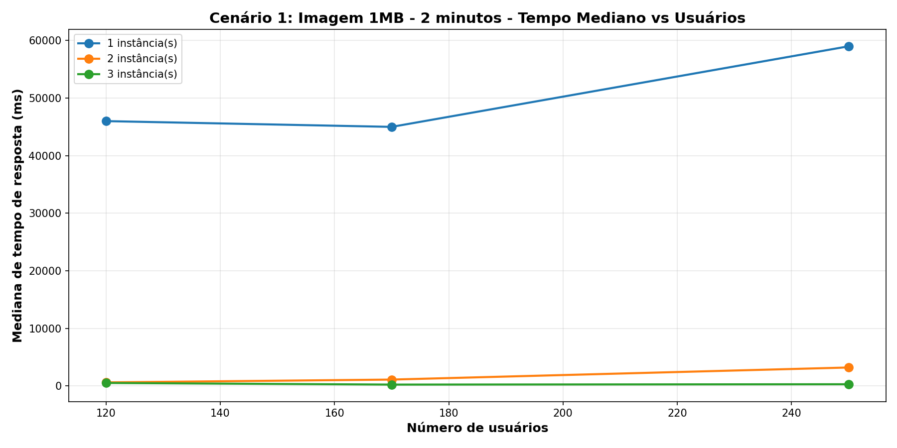

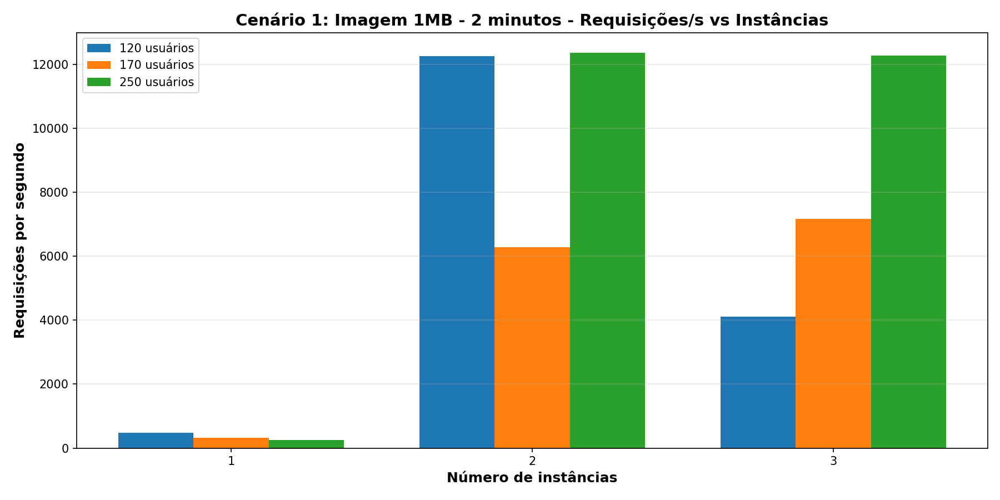

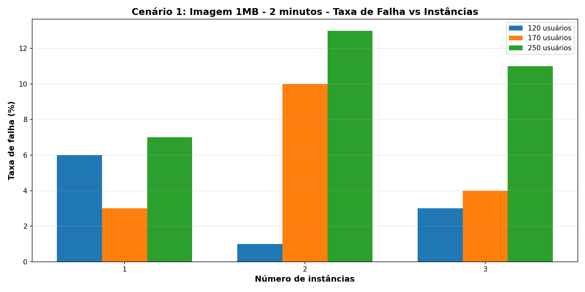

### Cenário 2: Texto 400KB

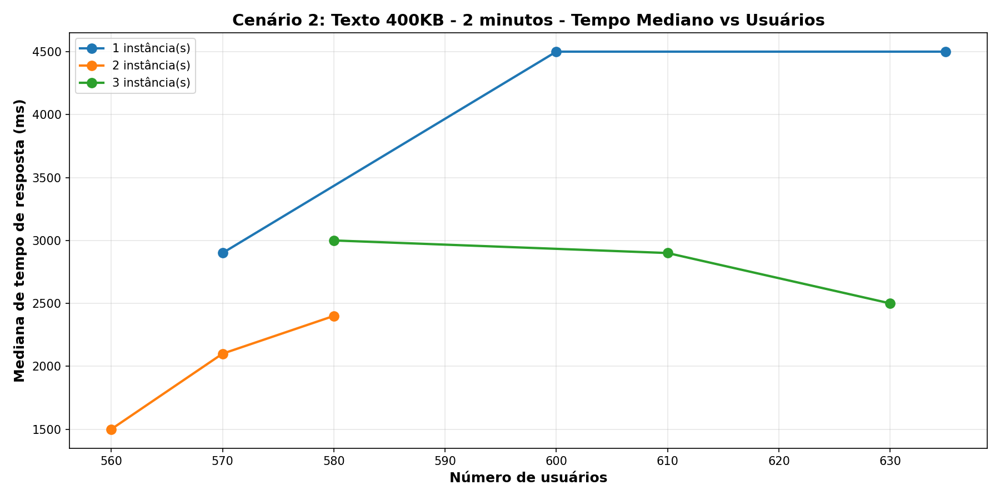

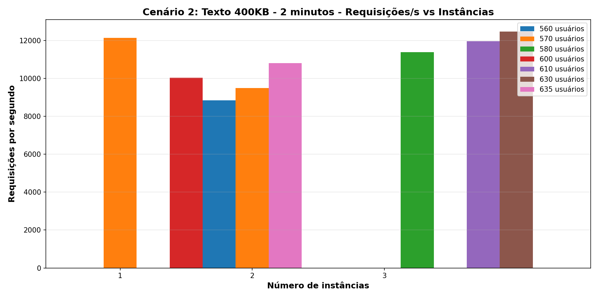

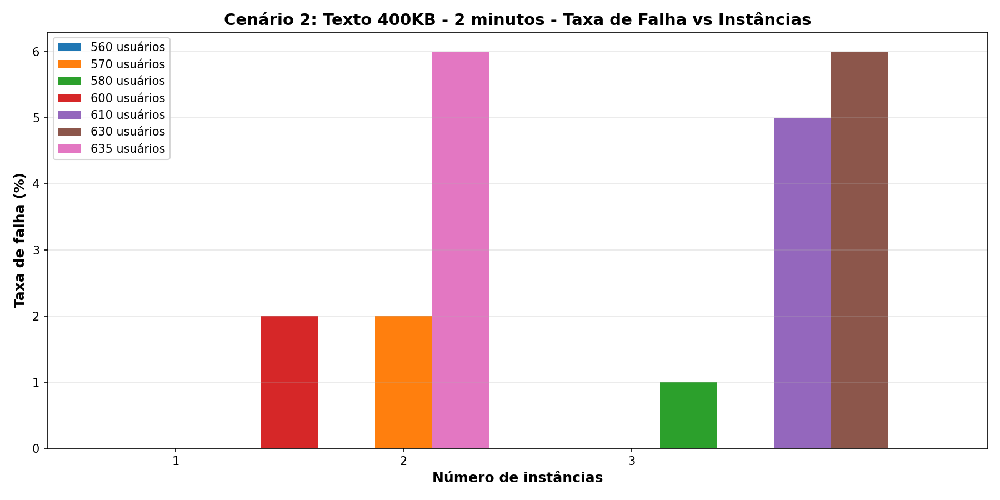

### Cenário 3: Imagem 300KB

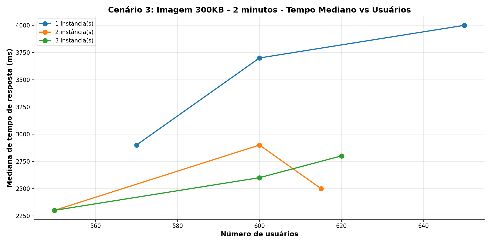

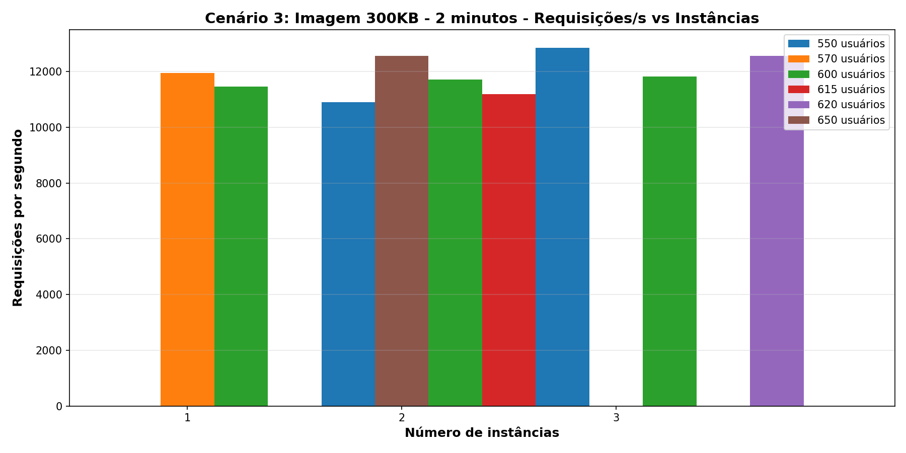

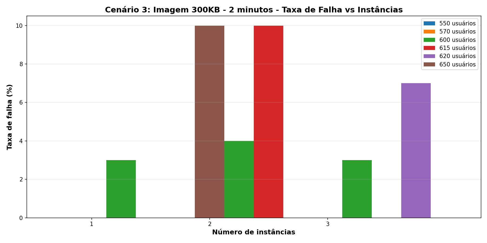

### Cenário 4: Híbrido

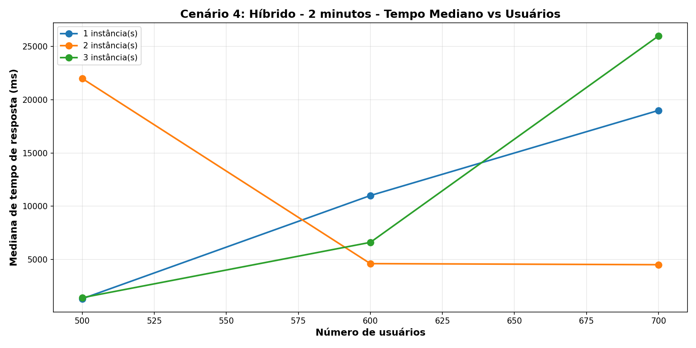

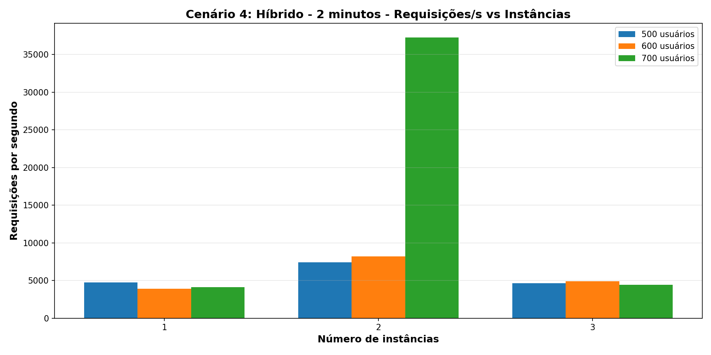

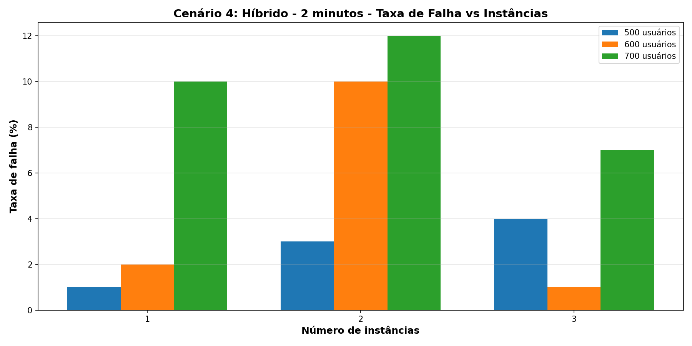

### Comparação Entre Cenários

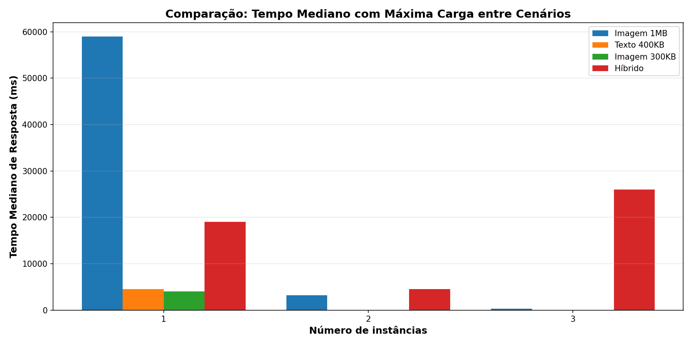

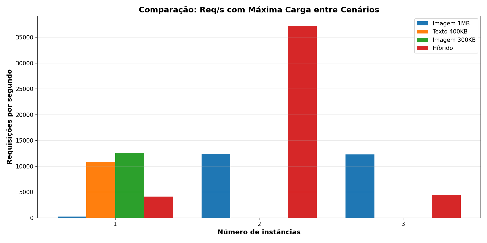

---
