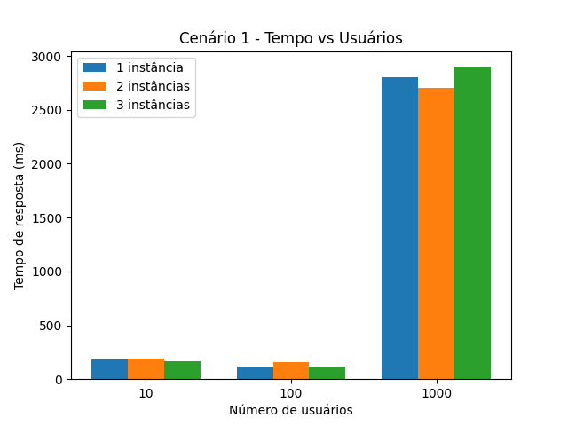
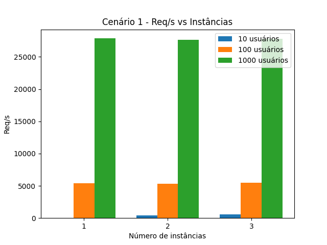
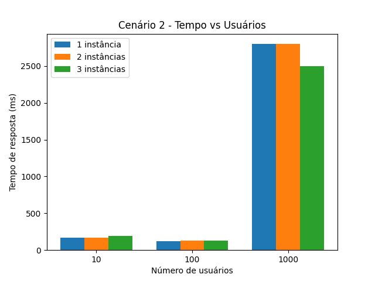
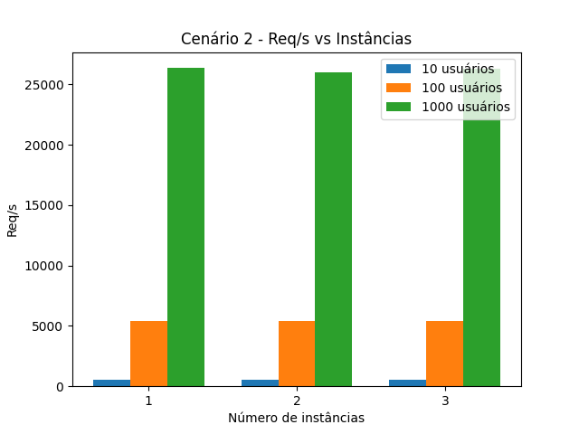
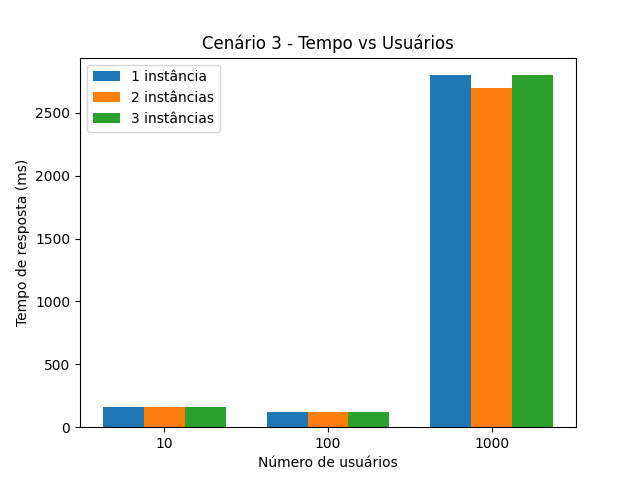
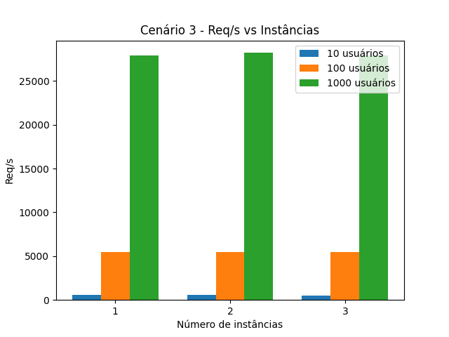

# Relatório de Testes de Performance - Locust

Testes de carga realizados com diferentes cenários para avaliação de performance do sistema WordPress utilizando múltiplas instâncias e o gerador de carga Locust.

---

## Cenário 1: Imagem 1MB - 2 minutos - Ramp up 2,10,50

| Instâncias | Usuários | Req/s | Mediana (ms) | 95% (ms) | Falha/s |
|------------|----------|-------|--------------|----------|---------|
| 1          | 10       | 55    | 180          | 390      | 0       |
| 1          | 100      | 5436  | 120          | 320      | 0       |
| 1          | 1000     | 27871 | 2800         | 3600     | 9308    |
| 2          | 10       | 534   | 160          | 400      | 0       |
| 2          | 100      | 5423  | 120          | 350      | 0       |
| 2          | 1000     | 27662 | 2700         | 5000     | 12056   |
| 3          | 10       | 538   | 170          | 370      | 0       |
| 3          | 100      | 5440  | 120          | 330      | 0       |
| 3          | 1000     | 27838 | 2900         | 4800     | 11616   |

### Gráficos

---

## Cenário 2: Texto 400KB - 2 minutos - Ramp up 2,10,50

| Instâncias | Usuários | Req/s | Mediana (ms) | 95% (ms) | Falha/s |
|------------|----------|-------|--------------|----------|---------|
| 1          | 10       | 533   | 170          | 390      | 0       |
| 1          | 100      | 5429  | 120          | 320      | 0       |
| 1          | 1000     | 26355 | 2800         | 5100     | 10199   |
| 2          | 10       | 541   | 170          | 370      | 0       |
| 2          | 100      | 5383  | 130          | 390      | 0       |
| 2          | 1000     | 26031 | 2800         | 5300     | 10504   |
| 3          | 10       | 538   | 190          | 430      | 0       |
| 3          | 100      | 5411  | 130          | 360      | 0       |
| 3          | 1000     | 26272 | 2500         | 5600     | 11291   |

### Gráficos

---

## Cenário 3: Imagem 300KB - 2 minutos - Ramp up 2,10,50

| Instâncias | Usuários | Req/s | Mediana (ms) | 95% (ms) | Falha/s |
|------------|----------|-------|--------------|----------|---------|
| 1          | 10       | 548   | 160          | 370      | 0       |
| 1          | 100      | 5465  | 120          | 300      | 0       |
| 1          | 1000     | 27901 | 2800         | 4100     | 9777    |
| 2          | 10       | 554   | 160          | 350      | 0       |
| 2          | 100      | 5436  | 120          | 290      | 0       |
| 2          | 1000     | 28210 | 2700         | 4400     | 10538   |
| 3          | 10       | 535   | 160          | 420      | 0       |
| 3          | 100      | 5461  | 120          | 360      | 0       |
| 3          | 1000     | 27920 | 2800         | 3400     | 8748    |

### Gráficos

---

## Resumo das Métricas

- **Req/s**: Requisições por segundo  
- **Mediana (ms)**: Tempo mediano de resposta em milissegundos  
- **95% (ms)**: Percentil 95 do tempo de resposta  
- **Falha/s**: Número de requisições que falharam por segundo  

---

## Análise dos Resultados

Os testes demonstram que o sistema apresenta bom desempenho para cargas de até 100 usuários, mantendo baixos tempos de resposta e ausência de falhas.

Entretanto, ao atingir 1000 usuários simultâneos, observa-se um aumento significativo no tempo de resposta e no número de falhas, indicando que a infraestrutura atinge seu limite operacional.

O aumento do número de instâncias do WordPress contribui para melhor distribuição da carga, proporcionando pequenas melhorias de desempenho. No entanto, essa estratégia não é suficiente para eliminar completamente as falhas em cenários de carga extrema.

Além disso, observa-se que conteúdos mais leves, como a imagem de 300KB e o texto de 400KB, apresentam desempenho ligeiramente superior em comparação ao cenário com imagem de 1MB, evidenciando o impacto do tamanho do conteúdo no tempo de resposta do sistema.
