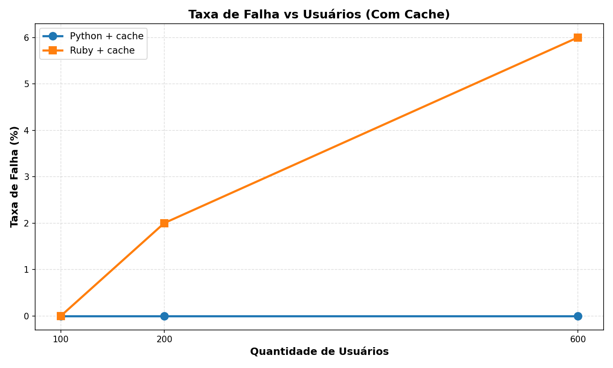
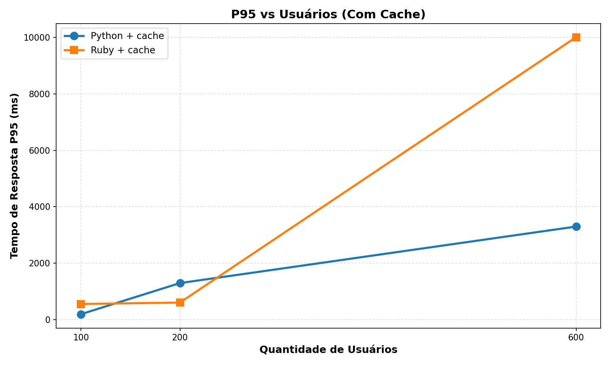
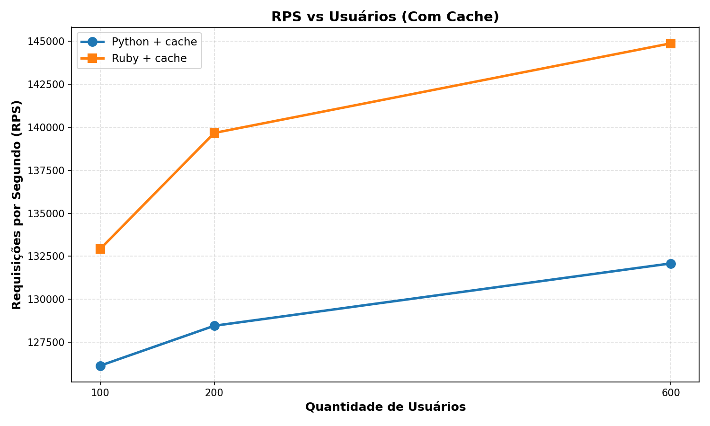
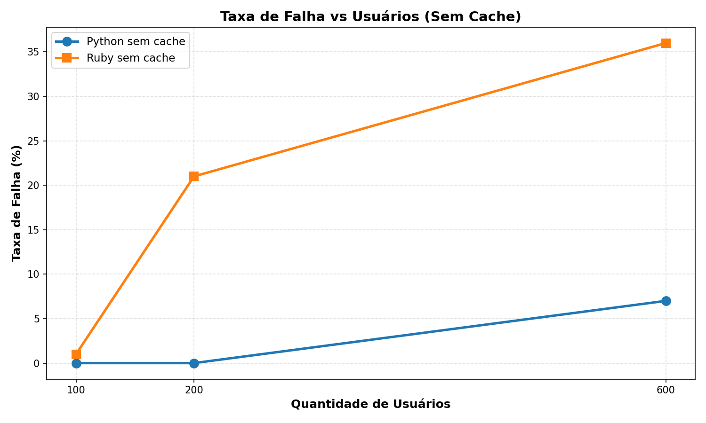
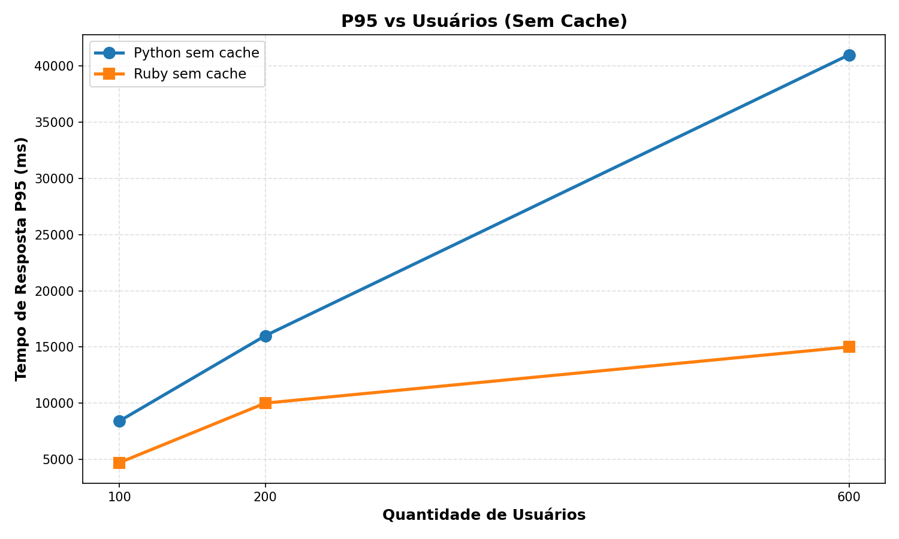
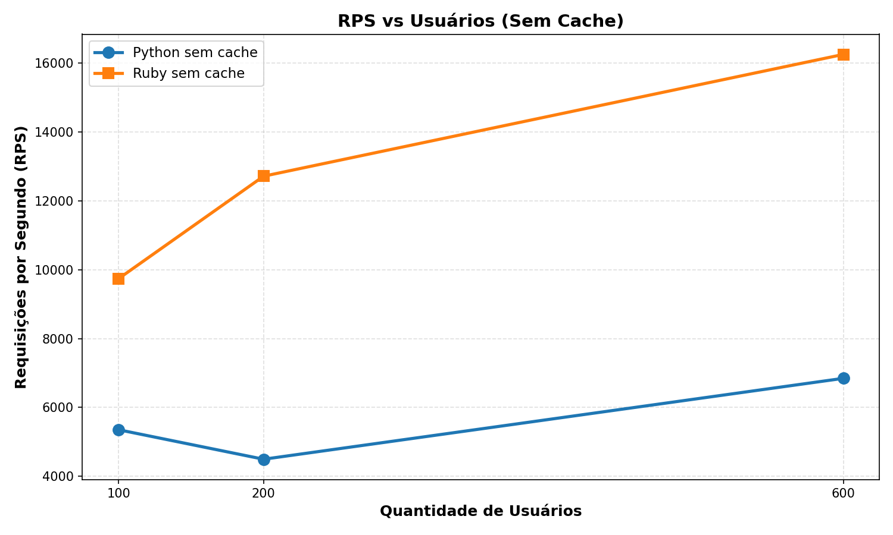
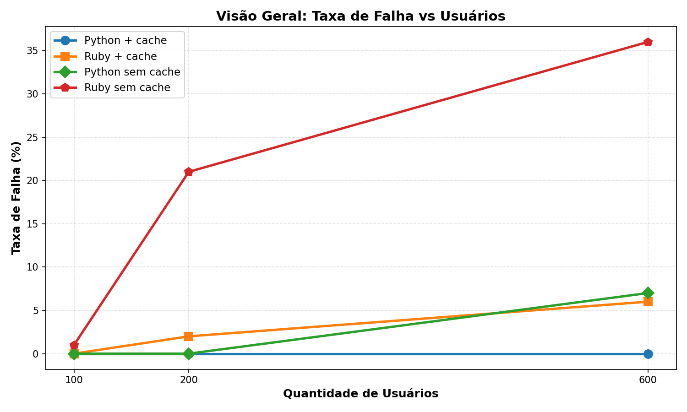
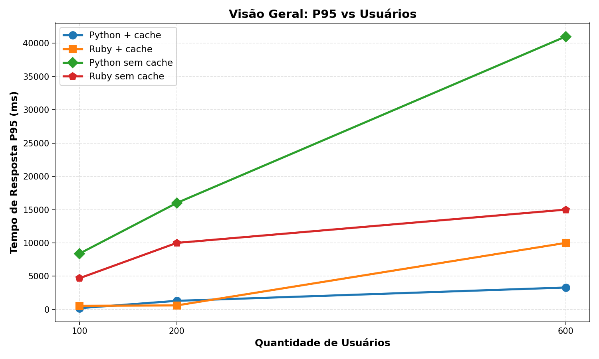
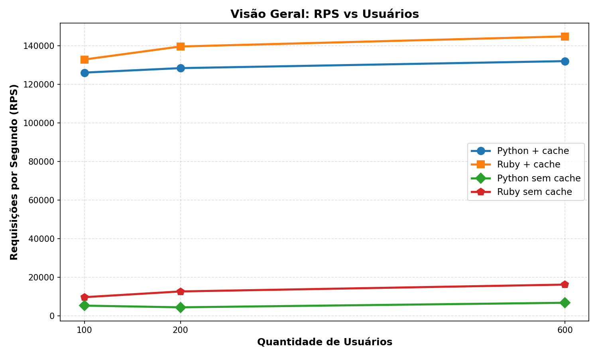

# Link Extractor — Testes de Carga (Python / Ruby, com e sem Redis)

Este repositório contém a infraestrutura e os resultados para o trabalho de **Realização de Testes de Desempenho com a Aplicação Link Extractor**. O objetivo é analisar a performance de requisições web utilizando diferentes linguagens (Python e Ruby), avaliando o impacto da introdução de uma camada de cache (Redis).

## Arquitetura e Cenários

A aplicação foi testada em quatro cenários isolados:

| Cenário | Compose | API |
|---------|---------|-----|
| Python + cache Redis | `docker-compose.python-cache.yml` | Flask + `redis` (`5000`) |
| Python sem cache | `docker-compose.python-no-cache.yml` | Flask (`5000`) |
| Ruby + cache Redis | `docker-compose.ruby-cache.yml` | Sinatra + `redis` (`4567`) |
| Ruby sem cache | `docker-compose.ruby-no-cache.yml` | Sinatra (`4567`) |

**Ferramenta de Carga**: Os testes foram executados no k6, aplicando uma lógica de 10 invocações por usuário virtual contra a API variando as URLs analisadas.

---

## Resultados dos Testes de Desempenho

Os testes foram executados com os seguintes parâmetros:
- Ramp-up de 3 segundos;
- Cargas progressivas de 100, 200 e 600 utilizadores virtuais;
- Duração de 5 minutos por teste.

### Tabelas de Resultados Consolidadas

#### Cenário 1: Python + Redis (com cache)
| Utilizadores | Ramp-up (s) | Req/s | Mediana (ms) | P95 (ms) | Falhas | Taxa Falha |
|---------------|-------------|-------|-------------|----------|--------|-----------|
| 100           | 3           | 126133 | 130         | 200      | 0      | 0%        |
| 200           | 3           | 128455 | 220         | 1300     | 0      | 0%        |
| 600           | 3           | 132082 | 240         | 3300     | 8      | 0%        |

#### Cenário 2: Python sem cache
| Utilizadores | Ramp-up (s) | Req/s | Mediana (ms) | P95 (ms) | Falhas | Taxa Falha |
|---------------|-------------|-------|-------------|----------|--------|-----------|
| 100           | 3           | 5350  | 5200        | 8400     | 0      | 0%        |
| 200           | 3           | 4494  | 9300        | 16000    | 0      | 0%        |
| 600           | 3           | 6844  | 9300        | 41000    | 451    | 7%        |

#### Cenário 3: Ruby + Redis (com cache)
| Utilizadores | Ramp-up (s) | Req/s  | Mediana (ms) | P95 (ms) | Falhas | Taxa Falha |
|---------------|-------------|--------|-------------|----------|--------|-----------|
| 100           | 3           | 132922 | 160         | 560      | 0      | 0%        |
| 200           | 3           | 139673 | 160         | 610      | 2445   | 2%        |
| 600           | 3           | 144886 | 170         | 10000    | 8881   | 6%        |

#### Cenário 4: Ruby sem cache
| Utilizadores | Ramp-up (s) | Req/s | Mediana (ms) | P95 (ms) | Falhas | Taxa Falha |
|---------------|-------------|-------|-------------|----------|--------|-----------|
| 100           | 3           | 9741  | 2400        | 4700     | 51     | 1%        |
| 200           | 3           | 12716 | 2800        | 10000    | 2671   | 21%       |
| 600           | 3           | 16254 | 3400        | 15000    | 5827   | 36%       |

---

## Gráficos e Conclusões

### 1. Cenários COM Cache (Python vs Ruby)

**Conclusão**: Com o uso do Redis, a arquitetura Python demonstra uma confiabilidade excepcional, mantendo a taxa de falhas praticamente nula mesmo a 600 usuários. Já a arquitetura Ruby começa a demonstrar limitações a partir dos 200 usuários, falhando progressivamente e atingindo erros notáveis sob alta carga (6%).

**Conclusão**: O tempo de resposta para 95% dos usuários subiu vertiginosamente no Ruby quando sujeito a 600 utilizadores, acusando colapso de algumas conexões, enquanto a API em Python continuou com tempos bastante razoáveis e estabilizados.

**Conclusão**: Ambas as linguagens respondem a um número muito alto de Requisições por Segundo (RPS) com o cache ativo. Embora o Ruby pareça ligeiramente superior neste contexto absoluto, isto é compensado pela ocorrência de latências maiores e falhas críticas durante picos, mantendo o throughput do ecossistema Python globalmente mais eficiente por ser estritamente livre de perdas.

### 2. Cenários SEM Cache (Python vs Ruby)

**Conclusão**: A ausência do Redis expõe a infraestrutura. O Ruby tem um colapso imediato e trágico (mais de 35% de conexões falhadas nos 600 usuários), demonstrando não lidar bem com uma fila exaustiva de processos de backend. O Python comporta-se de forma mais fiável, sacrificando o tempo de resposta em favor da robustez, e retendo a taxa de falha em meros 7% na mesma carga.

**Conclusão**: Ambas as linguagens perdem capacidade de resolver as tarefas de forma veloz. Enquanto o Ruby apresenta respostas numericamente mais curtas nalguns momentos, faz isso à custa de devoluções de erros e descartes. O Python resiste, mas atrasa massivamente a latência (atingindo a barreira dos 40 segundos no registo P95) perante a saturação do servidor web, ainda assim processando muito mais cargas resolvidas e sem quebrar as submissões como o Ruby Webserver faz.

**Conclusão**: Sem Redis, a quantidade de dados passados nas duas realidades cai exponencialmente. A carga de I/O de aguardar resposta atinge os limites dos workers sem uma camada de cache intermediária.

### 3. Visão Geral Comparativa

**Conclusão Final (Falhas)**: O gráfico agrupado mostra a distinção colossal que a cache introduz, contendo as perdas na casa dos 0% no ecossistema de Python, enquanto a ausência desta estrutura propicia dezenas de milhares de erros acumulados entre utilizadores frustrados pelo timing do Webserver subjacente do lado do Ruby.

**Conclusão Final (P95)**: A performance de retorno foi ditada estritamente pelo auxílio da memória em-memória de alta resiliência. O cache em Python estabelece-se irrevogavelmente como o cenário principal incontestável na avaliação de tempo útil para a resposta.

**Conclusão Final (RPS/Throughput)**: A implementação de cache é a artéria vital da performance (produzindo quase mais ~120x requisições tratadas por segundo). O sistema de requisições de Python suportado em Redis é, globalmente, a escolha arquitetónica mais estável e recomendada face às exigências impostas.