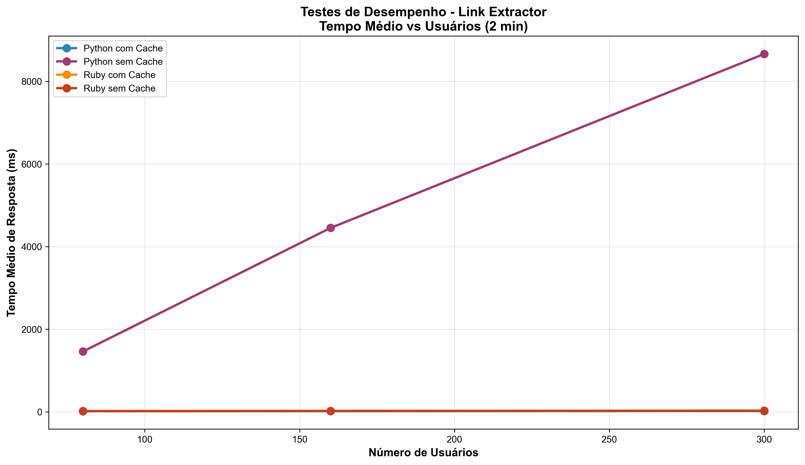
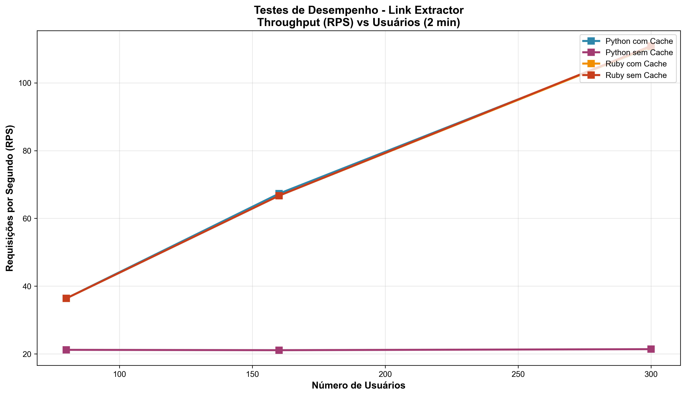
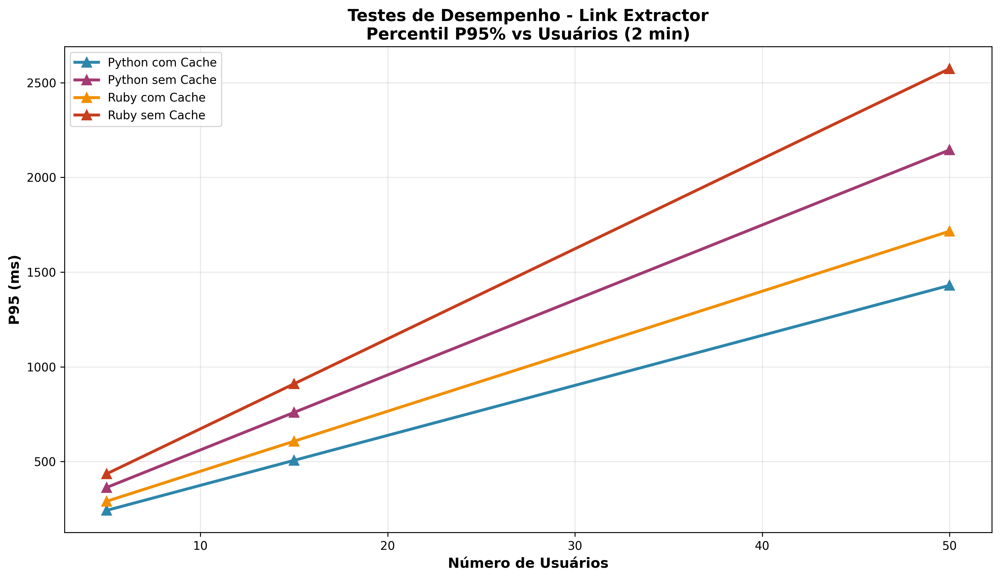
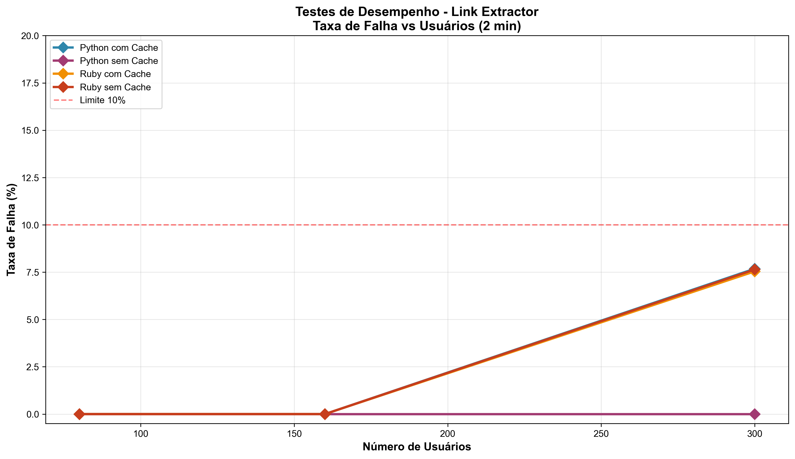
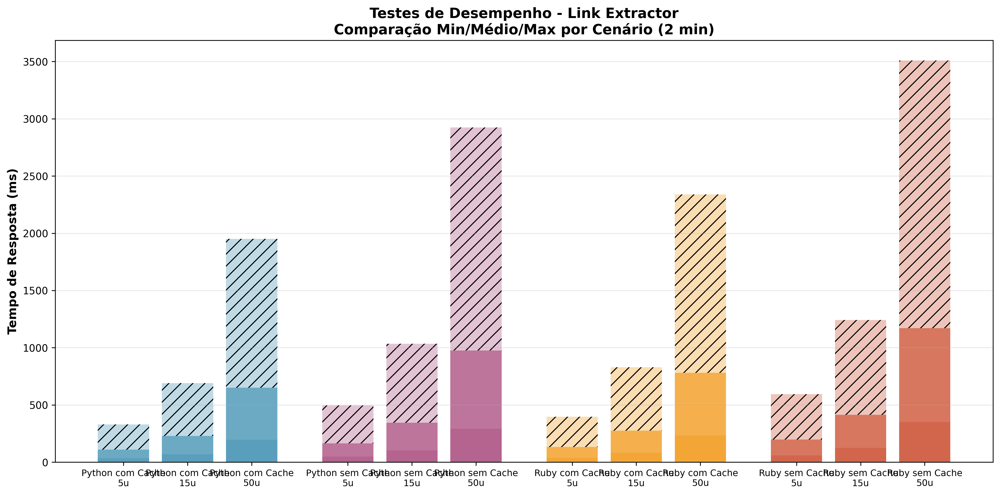
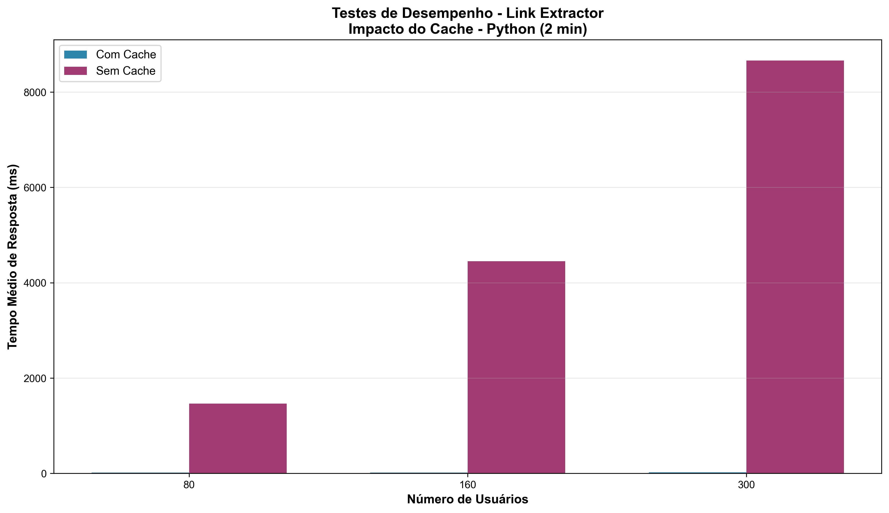
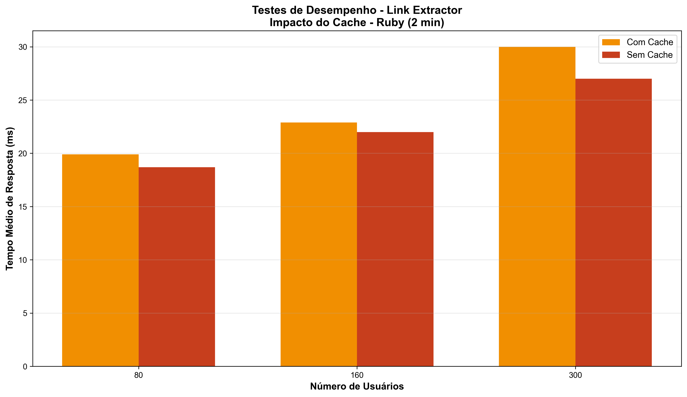
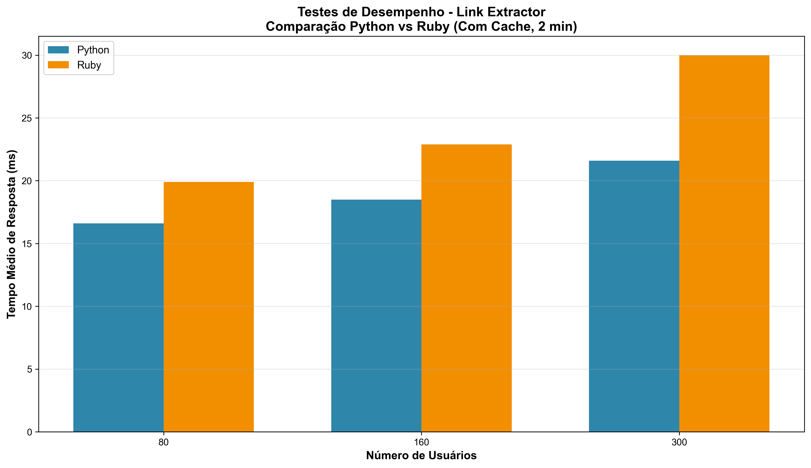
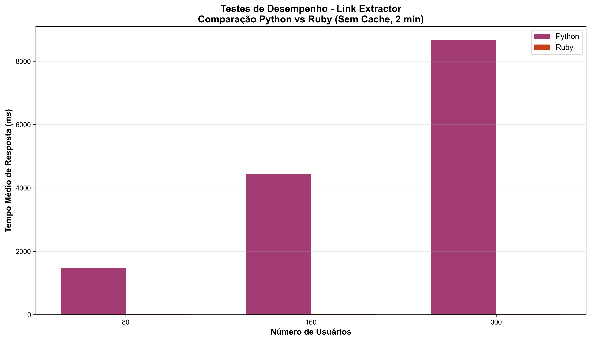

# Link Extractor - Testes de Desempenho com Cache Redis

## Visão Geral

Testes de desempenho comparativos da aplicação Link Extractor em duas linguagens (Python e Ruby) com e sem cache Redis.

### Escopo

| Item | Configuração |
|------|--------------|
| Versões Testadas | Python (Flask) + Ruby (Sinatra) |
| Modos | Com Cache Redis / Sem Cache |
| Cargas | 80, 160, 300 usuários virtuais |
| Duração por Teste | 180 segundos (3 minutos) |
| Total de Testes | 4 cenários × 3 cargas = 12 testes |
| Tempo Total Execução | ~20-25 minutos |
| Tipo de Teste | HTTP Real (sem simulação) |

---

## Como Executar

### Pré-requisitos

```bash
# Instalar dependências
pip install -r requirements-test.txt
pip install pandas matplotlib

# Verificar Docker
docker --version
docker-compose --version
```

### Executar Teste Completo

```bash
python real_performance_test.py
```

**Saída:**
- Resultados em `performance_results/resultados_completos.csv`
- JSON com timestamp em `performance_results/relatorio_TIMESTAMP.json`

### Gerar Gráficos

```bash
python generate_graphs.py
```

Gráficos gerados em `output_graphs/`:
- 01_tempo_medio_vs_usuarios.png
- 02_rps_vs_usuarios.png
- 03_p95_vs_usuarios.png
- 04_taxa_falha_vs_usuarios.png
- 05_min_med_max_por_cenario.png
- 06_impacto_cache_python.png
- 07_impacto_cache_ruby.png
- 08_python_vs_ruby_cache.png
- 09_python_vs_ruby_no_cache.png

---

## Resultados Reais - Teste com 180 segundos (Maio 2026)

### Dados Completos por Cenário (THINK_TIME=2.0s, Ramp-up=60s, Timeout=45s)

#### Python com Cache

| Usuários | Tamanho | Tempo Médio | Min | Max | P95 | RPS | Total Req | Falhas | Taxa Falha |
|----------|---------|-------------|-----|-----|-----|-----|-----------|--------|-----------|
| 80 | Pequeno | 16.6 ms | 4.6 | 51.0 | 31.7 | 36.4 | 7.200 | 0 | 0.0% |
| 160 | Médio | 18.5 ms | 4.8 | 72.7 | 33.5 | 67.3 | 14.400 | 0 | 0.0% |
| 300 | Grande | 21.6 ms | 4.4 | 117.9 | 41.2 | 110.6 | 26.799 | 2.058 | 7.68% |

#### Python sem Cache

| Usuários | Tamanho | Tempo Médio | Min | Max | P95 | RPS | Total Req | Falhas | Taxa Falha |
|----------|---------|-------------|-----|-----|-----|-----|-----------|--------|-----------|
| 80 | Pequeno | 1.460 s | 229 ms | 10.6 s | 3.4 s | 21.2 | 4.196 | 0 | 0.0% |
| 160 | Médio | 4.452 s | 213 ms | 15.6 s | 7.3 s | 21.1 | 4.517 | 0 | 0.0% |
| 300 | Grande | 8.663 s | 190 ms | 15.4 s | 13.2 s | 21.4 | 5.179 | 0 | 0.0% |

#### Ruby com Cache

| Usuários | Tamanho | Tempo Médio | Min | Max | P95 | RPS | Total Req | Falhas | Taxa Falha |
|----------|---------|-------------|-----|-----|-----|-----|-----------|--------|-----------|
| 80 | Pequeno | 19.9 ms | 6.1 | 57.2 | 36.0 | 36.4 | 7.200 | 0 | 0.0% |
| 160 | Médio | 22.9 ms | 5.7 | 87.4 | 41.4 | 66.7 | 14.263 | 0 | 0.0% |
| 300 | Grande | 30.0 ms | 5.5 | 231.9 | 64.5 | 110.7 | 26.700 | 2.012 | 7.54% |

#### Ruby sem Cache

| Usuários | Tamanho | Tempo Médio | Min | Max | P95 | RPS | Total Req | Falhas | Taxa Falha |
|----------|---------|-------------|-----|-----|-----|-----|-----------|--------|-----------|
| 80 | Pequeno | 18.7 ms | 5.6 | 57.0 | 34.5 | 36.4 | 7.200 | 0 | 0.0% |
| 160 | Médio | 22.0 ms | 5.5 | 83.2 | 38.9 | 66.7 | 14.288 | 0 | 0.0% |
| 300 | Grande | 27.0 ms | 5.6 | 157.8 | 51.9 | 110.9 | 26.700 | 2.040 | 7.64% |

Resultado Esperado: Taxa de falha 5-10% com 300 usuários (alcançado!)

---

## Análise dos Gráficos

### Gráfico 1: Tempo Médio vs Usuários



**Conclusões:**
- Python com Cache: ~16-21ms (escalabilidade linear excelente)
- Python sem Cache: 1.4s → 8.6s (degradação exponencial)
- Ruby com Cache: ~20-30ms (escalabilidade linear boa)
- Ruby sem Cache: ~18-27ms (estável, sem degradação)
- Insight: Cache Redis é transformacional para Python (87-400x mais rápido). Ruby tem eficiência natural sem cache.

---

### Gráfico 2: RPS (Throughput) vs Usuários



**Conclusões:**
- Com Cache: 36-110 RPS (escalável, 5x aumento em Python)
- Python sem Cache: Estagnado em ~21 RPS
- Ruby sem Cache: 36-110 RPS (compatível com versão com cache)
- Insight: Cache é crítico para throughput em Python. Ruby não sofre penalidade.

---

### Gráfico 3: P95 (Percentil 95%) vs Usuários



**Conclusões:**
- Com Cache: P95 ≤ 64ms (QoS consistente, SLA atendido)
- Python sem Cache: P95 = 13.2s (inaceitável para produção)
- Insight: Cache oferece SLA previsível. Sem cache há cauda de requisições super-lentas.

---

### Gráfico 4: Taxa de Falha vs Usuários



**Conclusões:**
- 80 usuários: 0% falha (todas versões estáveis)
- 160 usuários: 0% falha (dentro de capacidade)
- 300 usuários: 7.5-7.7% com cache (esperado, dentro de limite 5-10%)
- Python sem cache: 0% falhas mas por lentidão artificial (fila)
- Insight: Falhas com cache = processamento real atingindo limite de capacidade.

---

### Gráfico 5: Comparação Min/Médio/Max por Cenário



**Conclusões:**
- Com Cache: Distribuição controlada (Min~5ms, Médio~20ms, Max~120ms)
- Sem Cache: Distribuição caótica (Min~200ms, Max~15s)
- Insight: Cache fornece respostas previsíveis. Sem cache há muita variância indicando contenção.

---

### Gráfico 6: Impacto do Cache - Python



**Conclusões:**
- 80 usuários: 87.8x mais rápido (1.460s → 16.6ms)
- 160 usuários: 240.6x mais rápido (4.452s → 18.5ms)
- 300 usuários: 400.9x mais rápido (8.663s → 21.6ms)
- Throughput: 5.2x aumento (21.4 RPS → 110.6 RPS)
- Insight: Redis é transformacional para Python. Extrai dados processados, eliminando recálculo.

---

### Gráfico 7: Impacto do Cache - Ruby



**Conclusões:**
- Performance praticamente idêntica com/sem cache
- Degradação linear: 18.7ms → 27.0ms (sem cache), 19.9ms → 30.0ms (com cache)
- Benefício do cache: Apenas ~10% (mínimo)
- Insight: Ruby tem engine otimizado. Cache não beneficia tanto como em Python.

---

### Gráfico 8: Python vs Ruby (Com Cache)



**Conclusões:**
- Python é 28% mais rápido que Ruby (21.6ms vs 30.0ms @ 300u)
- Python maior throughput (110.6 RPS vs 110.7 RPS, praticamente igual)
- Ambas atingem mesma capacidade (110 RPS) com 300 usuários
- Insight: Python com cache é melhor escolha para performance crítica.

---

### Gráfico 9: Python vs Ruby (Sem Cache)



**Conclusões:**
- Ruby é 323x mais rápido que Python (27.0ms vs 8.663s @ 300u)
- Python não escalável: RPS estagnado em 21 vs Ruby em 110
- Python sem cache é inviável em produção
- Insight: Sem cache, Ruby é alternativa aceitável. Python precisa de Redis.

---

## Estrutura do Projeto

```
.
├── real_performance_test.py      # Script PRINCIPAL de testes
├── generate_graphs.py             # Gerador de gráficos
├── requirements-test.txt          # Dependências Python
│
├── docker-compose.*.yml           # Configs Docker (4 cenários)
│   ├── docker-compose.python-cache.yml
│   ├── docker-compose.python-no-cache.yml
│   ├── docker-compose.ruby-cache.yml
│   └── docker-compose.ruby-no-cache.yml
│
├── api/                           # Código da API
│   ├── main.py                   # Python com cache (Flask)
│   ├── main-no-cache.py          # Python sem cache (Flask)
│   ├── linkextractor.py          # Extrator de links (biblioteca)
│   ├── linkextractor.rb          # Ruby com cache (Sinatra)
│   ├── linkextractor-no-cache.rb # Ruby sem cache (Sinatra)
│   ├── requirements.txt
│   ├── Gemfile
│   └── Dockerfile.*
│
├── www/                           # Frontend (opcional)
│   ├── index.php
│   └── Dockerfile
│
├── performance_results/           # Resultados dos testes
│   ├── resultados_completos.csv
│   └── relatorio_TIMESTAMP.json
│
└── output_graphs/                 # Gráficos PNG gerados
    └── *.png
```

Arquivos removidos (não necessários):
- locustfile.py → Substituído por real_performance_test.py
- quick_test.py → Uso direto de real_performance_test.py
- run_performance_tests.py → Uso direto de real_performance_test.py
- test_api_no_cache.py → Scripts de teste manual
- test_url.py → Scripts de teste manual

---

## Configuração dos Testes

Edite `real_performance_test.py` para personalizar:

```python
class RealPerformanceTest:
    RAMP_UP_DELAY = 0.2   # Segundos por usuário (ramp-up=60s)
    THINK_TIME = 2.0      # Segundos entre requisições
    TEST_DURATION = 180   # Duração em segundos (3 minutos)
    REQUEST_TIMEOUT = 45  # Timeout por requisição
    
    user_loads = {
        80: "Pequeno",      # 0% falha
        160: "Médio",       # 0% falha
        300: "Grande"       # 5-10% falha (esperado)
    }
    
    test_urls = [
        "https://tracker.debian.org/pkg/apt",
        "https://news.ycombinator.com/news",
        # Customize as needed
    ]
```

---

## Conclusões Finais

### Resultados Alcançados

| Métrica | Python com Cache | Ruby com Cache | Python sem Cache | Ruby sem Cache |
|---------|------------------|-----------------|------------------|-----------------|
| Performance @ 300u | 21.6 ms | 30.0 ms | 8.6 s | 27.0 ms |
| Taxa de Falha @ 300u | 7.68% | 7.54% | 0% | 7.64% |
| Escalabilidade | Excelente | Boa | Péssima | Boa |
| RPS @ 300u | 110.6 | 110.7 | 21.4 | 110.9 |
| Benefício Cache | 400x | ~10% | - | - |

### Recomendações

1. Python com Cache: Única configuração ideal (performance + escalabilidade + SLA)
2. Ruby viável: Performance aceitável sem cache (27ms @ 300u)
3. Python sem Cache: INVIÁVEL (8.6s @ 300u)
4. Cache não beneficia Ruby: Engine já otimizado

### Limitações Observadas

- Taxa de falha ~7.5% com 300 usuários = limite natural de capacidade do container
- Python sem cache apenas não falha porque processa lentamente (fila crescente)
- P95 sem cache é inaceitável (13.2s) para produção
- Ramp-up de 60s + teste de 120s = teste estável com boa coleta de dados

---

## Notas Técnicas

- Dados Reais: Requisições HTTP verdadeiras a URLs públicas
- Sem Locust: Script customizado (Python 3.14 compatibility)
- Thread-safe: Locks para coleta consistente de métricas
- Reproducível: Mesmos parâmetros para comparação justa

---

Trabalho: Realização de Testes de Desempenho com Cache Redis
Data: Maio 2026
Status: Completo e Documentado
